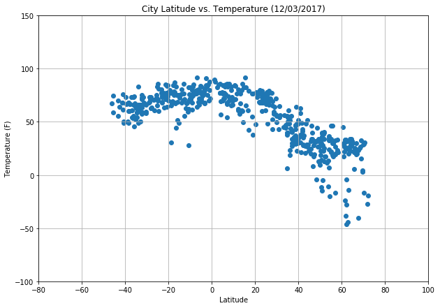
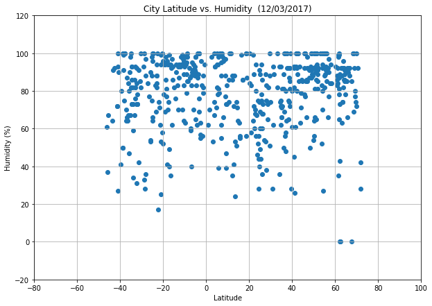
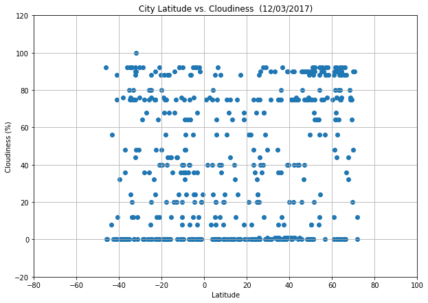
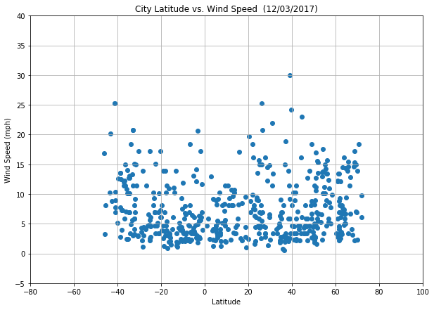

# WeatherPy

### Important Trends to Note:


<p>1. The temperature of cities is directly proportional to the latitude, with the highest temperatures occuring as we approach the equator, and going back down as we move away from it.  </p>
<p>2. The level of cloudiness in every city seems to vary evenly across latitudes, meaning that proximity to the equator does not affect its cloudiness, and we see an evenly distributed range of different cloudiness levels at every latitude.  </p>
<p>3. The humidity across cities does not seem to be related to latitude, and is instead mostly above 60% for most cities, regardless of latitude.  </p>


```python
# Dependencies
import matplotlib.pyplot as plt
import requests as req
import pandas as pd
from citipy import citipy
import numpy as np
import os
import random
import datetime as dt 

date = dt.date.today
date = dt.datetime.today().strftime("%m/%d/%Y")

```

### Getting List of Cities from Citipy Module, Across Latitudes and Longitudes


```python
# go through all coordinates
lat = range(-90,90)
lon = range(-180,180)

lats = []
lons = []
cities = []
city_list = []

for x in lat:
    for y in lon:
        name = (citipy.nearest_city(x,y)).city_name
        if name not in cities:
            cities.append(name)
            lats.append(x)
            lons.append(y)

df_9 = pd.DataFrame()
df_9["City"] = cities
df_9["Latitude"] = lats
df_9["Longitude"] = lons
```

### Pulling Uniformly Distributed Sample


```python
df_1 = df_9

list = [-60,-45,-30,-15,0,15,30,45,60,75]
final_sample = pd.DataFrame()
size = 80
for x in list:
    try:
        sample_df = df_1[(df_1['Latitude'] > x) & (df_1['Latitude'] < (x+15))].sample(n=size)
        final_sample = pd.concat([final_sample,sample_df])
        sample_df = pd.DataFrame()
    except ValueError:
        'Sample too small'
        sample_df = df_1[(df_1['Latitude'] > x) & (df_1['Latitude'] < (x+15))]
        if len(sample_df) > 0:
            sample_df = sample_df.sample(len(sample_df))
            final_sample = pd.concat([final_sample,sample_df])
            
        sample_df = pd.DataFrame()
    except ValueError:
        "Ignore"
    

final_sample.head()
print( "Sample size = " + str(len(final_sample)))

```

    Sample size = 667


```python
df_1.head()
```


<div>
<style>
    .dataframe thead tr:only-child th {
        text-align: right;
    }

    .dataframe thead th {
        text-align: left;
    }

    .dataframe tbody tr th {
        vertical-align: top;
    }
</style>
<table border="1" class="dataframe">
  <thead>
    <tr style="text-align: right;">
      <th></th>
      <th>City</th>
      <th>Latitude</th>
      <th>Longitude</th>
    </tr>
  </thead>
  <tbody>
    <tr>
      <th>0</th>
      <td>vaini</td>
      <td>-90</td>
      <td>-180</td>
    </tr>
    <tr>
      <th>1</th>
      <td>mataura</td>
      <td>-90</td>
      <td>-168</td>
    </tr>
    <tr>
      <th>2</th>
      <td>rikitea</td>
      <td>-90</td>
      <td>-141</td>
    </tr>
    <tr>
      <th>3</th>
      <td>punta arenas</td>
      <td>-90</td>
      <td>-127</td>
    </tr>
    <tr>
      <th>4</th>
      <td>ushuaia</td>
      <td>-90</td>
      <td>-92</td>
    </tr>
  </tbody>
</table>
</div>


### Generate Cities List


```python
sample_cities = final_sample["City"]
sample_cities.head()
```


    48         waitati
    49         wyndham
    51         lincoln
    40    port lincoln
    55         otautau
    Name: City, dtype: object


### Perform API Calls From OpenWeaterData


```python
url = 'http://api.openweathermap.org/data/2.5/weather'
api_key = 'd75d560ad688bb50a578b5fe3feab686'

params = {'appid': api_key,
          'q': '',
          'units': 'imperial'}

weather_data = []
cities = []
counter = 1
# Loop through the list of cities and perform a request for data on each
for city in sample_cities:
    # Get weather data
    try:
        city1 = city.replace(" ", "%20")
        params['q'] = city1
        url_used = url + '?appid=' + api_key + '&units=' + 'imperial' '&q=' + city1
        response = req.get(url, params=params).json()
        weather_data.append(response)
        print("Processing weather information for no." + str(counter) + ": " + city + '\n' + url_used)
        counter += 1
    except KeyError:
        "Not available"
    except AttributeError:
        "Ignore"
        
print("-----------------------------")
print("Data Retrieval Complete")
print("-----------------------------")


```

    Processing weather information for no.1: waitati
    http://api.openweathermap.org/data/2.5/weather?appid=d75d560ad688bb50a578b5fe3feab686&units=imperial&q=waitati
    Processing weather information for no.2: wyndham
    http://api.openweathermap.org/data/2.5/weather?appid=d75d560ad688bb50a578b5fe3feab686&units=imperial&q=wyndham
    Processing weather information for no.3: lincoln
    http://api.openweathermap.org/data/2.5/weather?appid=d75d560ad688bb50a578b5fe3feab686&units=imperial&q=lincoln
    Processing weather information for no.4: port lincoln
    http://api.openweathermap.org/data/2.5/weather?appid=d75d560ad688bb50a578b5fe3feab686&units=imperial&q=port%20lincoln
    Processing weather information for no.5: otautau
    http://api.openweathermap.org/data/2.5/weather?appid=d75d560ad688bb50a578b5fe3feab686&units=imperial&q=otautau
    Processing weather information for no.6: plettenberg bay
    http://api.openweathermap.org/data/2.5/weather?appid=d75d560ad688bb50a578b5fe3feab686&units=imperial&q=plettenberg%20bay
    Processing weather information for no.7: jamestown
    http://api.openweathermap.org/data/2.5/weather?appid=d75d560ad688bb50a578b5fe3feab686&units=imperial&q=jamestown
    Processing weather information for no.8: rio gallegos
    http://api.openweathermap.org/data/2.5/weather?appid=d75d560ad688bb50a578b5fe3feab686&units=imperial&q=rio%20gallegos
    Processing weather information for no.9: rawson
    http://api.openweathermap.org/data/2.5/weather?appid=d75d560ad688bb50a578b5fe3feab686&units=imperial&q=rawson
    Processing weather information for no.10: waipawa
    http://api.openweathermap.org/data/2.5/weather?appid=d75d560ad688bb50a578b5fe3feab686&units=imperial&q=waipawa
    Processing weather information for no.11: castro
    http://api.openweathermap.org/data/2.5/weather?appid=d75d560ad688bb50a578b5fe3feab686&units=imperial&q=castro
    Processing weather information for no.12: christchurch
    http://api.openweathermap.org/data/2.5/weather?appid=d75d560ad688bb50a578b5fe3feab686&units=imperial&q=christchurch
    Processing weather information for no.13: necochea
    http://api.openweathermap.org/data/2.5/weather?appid=d75d560ad688bb50a578b5fe3feab686&units=imperial&q=necochea
    Processing weather information for no.14: milton
    http://api.openweathermap.org/data/2.5/weather?appid=d75d560ad688bb50a578b5fe3feab686&units=imperial&q=milton
    Processing weather information for no.15: viedma
    http://api.openweathermap.org/data/2.5/weather?appid=d75d560ad688bb50a578b5fe3feab686&units=imperial&q=viedma
    Processing weather information for no.16: laguna
    http://api.openweathermap.org/data/2.5/weather?appid=d75d560ad688bb50a578b5fe3feab686&units=imperial&q=laguna
    Processing weather information for no.17: burnie
    http://api.openweathermap.org/data/2.5/weather?appid=d75d560ad688bb50a578b5fe3feab686&units=imperial&q=burnie
    Processing weather information for no.18: umzimvubu
    http://api.openweathermap.org/data/2.5/weather?appid=d75d560ad688bb50a578b5fe3feab686&units=imperial&q=umzimvubu
    Processing weather information for no.19: comodoro rivadavia
    http://api.openweathermap.org/data/2.5/weather?appid=d75d560ad688bb50a578b5fe3feab686&units=imperial&q=comodoro%20rivadavia
    Processing weather information for no.20: mahebourg
    http://api.openweathermap.org/data/2.5/weather?appid=d75d560ad688bb50a578b5fe3feab686&units=imperial&q=mahebourg
    Processing weather information for no.21: southbridge
    http://api.openweathermap.org/data/2.5/weather?appid=d75d560ad688bb50a578b5fe3feab686&units=imperial&q=southbridge
    Processing weather information for no.22: saldanha
    http://api.openweathermap.org/data/2.5/weather?appid=d75d560ad688bb50a578b5fe3feab686&units=imperial&q=saldanha
    Processing weather information for no.23: margate
    http://api.openweathermap.org/data/2.5/weather?appid=d75d560ad688bb50a578b5fe3feab686&units=imperial&q=margate
    Processing weather information for no.24: rocha
    http://api.openweathermap.org/data/2.5/weather?appid=d75d560ad688bb50a578b5fe3feab686&units=imperial&q=rocha
    Processing weather information for no.25: coihaique
    http://api.openweathermap.org/data/2.5/weather?appid=d75d560ad688bb50a578b5fe3feab686&units=imperial&q=coihaique
    Processing weather information for no.26: esperance
    http://api.openweathermap.org/data/2.5/weather?appid=d75d560ad688bb50a578b5fe3feab686&units=imperial&q=esperance
    Processing weather information for no.27: arraial do cabo
    http://api.openweathermap.org/data/2.5/weather?appid=d75d560ad688bb50a578b5fe3feab686&units=imperial&q=arraial%20do%20cabo
    Processing weather information for no.28: luderitz
    http://api.openweathermap.org/data/2.5/weather?appid=d75d560ad688bb50a578b5fe3feab686&units=imperial&q=luderitz
    Processing weather information for no.29: constitucion
    http://api.openweathermap.org/data/2.5/weather?appid=d75d560ad688bb50a578b5fe3feab686&units=imperial&q=constitucion
    Processing weather information for no.30: mercedes
    http://api.openweathermap.org/data/2.5/weather?appid=d75d560ad688bb50a578b5fe3feab686&units=imperial&q=mercedes
    Processing weather information for no.31: kyabram
    http://api.openweathermap.org/data/2.5/weather?appid=d75d560ad688bb50a578b5fe3feab686&units=imperial&q=kyabram
    Processing weather information for no.32: kokstad
    http://api.openweathermap.org/data/2.5/weather?appid=d75d560ad688bb50a578b5fe3feab686&units=imperial&q=kokstad
    Processing weather information for no.33: middelburg
    http://api.openweathermap.org/data/2.5/weather?appid=d75d560ad688bb50a578b5fe3feab686&units=imperial&q=middelburg
    Processing weather information for no.34: willowmore
    http://api.openweathermap.org/data/2.5/weather?appid=d75d560ad688bb50a578b5fe3feab686&units=imperial&q=willowmore
    Processing weather information for no.35: dom pedrito
    http://api.openweathermap.org/data/2.5/weather?appid=d75d560ad688bb50a578b5fe3feab686&units=imperial&q=dom%20pedrito
    Processing weather information for no.36: maldonado
    http://api.openweathermap.org/data/2.5/weather?appid=d75d560ad688bb50a578b5fe3feab686&units=imperial&q=maldonado
    Processing weather information for no.37: dargaville
    http://api.openweathermap.org/data/2.5/weather?appid=d75d560ad688bb50a578b5fe3feab686&units=imperial&q=dargaville
    Processing weather information for no.38: tolaga bay
    http://api.openweathermap.org/data/2.5/weather?appid=d75d560ad688bb50a578b5fe3feab686&units=imperial&q=tolaga%20bay
    Processing weather information for no.39: carahue
    http://api.openweathermap.org/data/2.5/weather?appid=d75d560ad688bb50a578b5fe3feab686&units=imperial&q=carahue
    Processing weather information for no.40: cradock
    http://api.openweathermap.org/data/2.5/weather?appid=d75d560ad688bb50a578b5fe3feab686&units=imperial&q=cradock
    Processing weather information for no.41: murray bridge
    http://api.openweathermap.org/data/2.5/weather?appid=d75d560ad688bb50a578b5fe3feab686&units=imperial&q=murray%20bridge
    Processing weather information for no.42: swan hill
    http://api.openweathermap.org/data/2.5/weather?appid=d75d560ad688bb50a578b5fe3feab686&units=imperial&q=swan%20hill
    Processing weather information for no.43: alta gracia
    http://api.openweathermap.org/data/2.5/weather?appid=d75d560ad688bb50a578b5fe3feab686&units=imperial&q=alta%20gracia
    Processing weather information for no.44: rio tercero
    http://api.openweathermap.org/data/2.5/weather?appid=d75d560ad688bb50a578b5fe3feab686&units=imperial&q=rio%20tercero
    Processing weather information for no.45: ballina
    http://api.openweathermap.org/data/2.5/weather?appid=d75d560ad688bb50a578b5fe3feab686&units=imperial&q=ballina
    Processing weather information for no.46: graneros
    http://api.openweathermap.org/data/2.5/weather?appid=d75d560ad688bb50a578b5fe3feab686&units=imperial&q=graneros
    Processing weather information for no.47: nueva helvecia
    http://api.openweathermap.org/data/2.5/weather?appid=d75d560ad688bb50a578b5fe3feab686&units=imperial&q=nueva%20helvecia
    Processing weather information for no.48: robertson
    http://api.openweathermap.org/data/2.5/weather?appid=d75d560ad688bb50a578b5fe3feab686&units=imperial&q=robertson
    Processing weather information for no.49: warragul
    http://api.openweathermap.org/data/2.5/weather?appid=d75d560ad688bb50a578b5fe3feab686&units=imperial&q=warragul
    Processing weather information for no.50: newcastle
    http://api.openweathermap.org/data/2.5/weather?appid=d75d560ad688bb50a578b5fe3feab686&units=imperial&q=newcastle
    Processing weather information for no.51: bombay
    http://api.openweathermap.org/data/2.5/weather?appid=d75d560ad688bb50a578b5fe3feab686&units=imperial&q=bombay
    Processing weather information for no.52: beloha
    http://api.openweathermap.org/data/2.5/weather?appid=d75d560ad688bb50a578b5fe3feab686&units=imperial&q=beloha
    Processing weather information for no.53: villa maria
    http://api.openweathermap.org/data/2.5/weather?appid=d75d560ad688bb50a578b5fe3feab686&units=imperial&q=villa%20maria
    Processing weather information for no.54: stellenbosch
    http://api.openweathermap.org/data/2.5/weather?appid=d75d560ad688bb50a578b5fe3feab686&units=imperial&q=stellenbosch
    Processing weather information for no.55: ngunguru
    http://api.openweathermap.org/data/2.5/weather?appid=d75d560ad688bb50a578b5fe3feab686&units=imperial&q=ngunguru
    Processing weather information for no.56: imbituba
    http://api.openweathermap.org/data/2.5/weather?appid=d75d560ad688bb50a578b5fe3feab686&units=imperial&q=imbituba
    Processing weather information for no.57: karamea
    http://api.openweathermap.org/data/2.5/weather?appid=d75d560ad688bb50a578b5fe3feab686&units=imperial&q=karamea
    Processing weather information for no.58: manutuke
    http://api.openweathermap.org/data/2.5/weather?appid=d75d560ad688bb50a578b5fe3feab686&units=imperial&q=manutuke
    Processing weather information for no.59: taree
    http://api.openweathermap.org/data/2.5/weather?appid=d75d560ad688bb50a578b5fe3feab686&units=imperial&q=taree
    Processing weather information for no.60: tres arroyos
    http://api.openweathermap.org/data/2.5/weather?appid=d75d560ad688bb50a578b5fe3feab686&units=imperial&q=tres%20arroyos
    Processing weather information for no.61: calvinia
    http://api.openweathermap.org/data/2.5/weather?appid=d75d560ad688bb50a578b5fe3feab686&units=imperial&q=calvinia
    Processing weather information for no.62: graaff-reinet
    http://api.openweathermap.org/data/2.5/weather?appid=d75d560ad688bb50a578b5fe3feab686&units=imperial&q=graaff-reinet
    Processing weather information for no.63: villarrica
    http://api.openweathermap.org/data/2.5/weather?appid=d75d560ad688bb50a578b5fe3feab686&units=imperial&q=villarrica
    Processing weather information for no.64: linares
    http://api.openweathermap.org/data/2.5/weather?appid=d75d560ad688bb50a578b5fe3feab686&units=imperial&q=linares
    Processing weather information for no.65: junin
    http://api.openweathermap.org/data/2.5/weather?appid=d75d560ad688bb50a578b5fe3feab686&units=imperial&q=junin
    Processing weather information for no.66: valparaiso
    http://api.openweathermap.org/data/2.5/weather?appid=d75d560ad688bb50a578b5fe3feab686&units=imperial&q=valparaiso
    Processing weather information for no.67: oxford
    http://api.openweathermap.org/data/2.5/weather?appid=d75d560ad688bb50a578b5fe3feab686&units=imperial&q=oxford
    Processing weather information for no.68: port shepstone
    http://api.openweathermap.org/data/2.5/weather?appid=d75d560ad688bb50a578b5fe3feab686&units=imperial&q=port%20shepstone
    Processing weather information for no.69: armidale
    http://api.openweathermap.org/data/2.5/weather?appid=d75d560ad688bb50a578b5fe3feab686&units=imperial&q=armidale
    Processing weather information for no.70: purranque
    http://api.openweathermap.org/data/2.5/weather?appid=d75d560ad688bb50a578b5fe3feab686&units=imperial&q=purranque
    Processing weather information for no.71: la rioja
    http://api.openweathermap.org/data/2.5/weather?appid=d75d560ad688bb50a578b5fe3feab686&units=imperial&q=la%20rioja
    Processing weather information for no.72: dubbo
    http://api.openweathermap.org/data/2.5/weather?appid=d75d560ad688bb50a578b5fe3feab686&units=imperial&q=dubbo
    Processing weather information for no.73: port macquarie
    http://api.openweathermap.org/data/2.5/weather?appid=d75d560ad688bb50a578b5fe3feab686&units=imperial&q=port%20macquarie
    Processing weather information for no.74: warrnambool
    http://api.openweathermap.org/data/2.5/weather?appid=d75d560ad688bb50a578b5fe3feab686&units=imperial&q=warrnambool
    Processing weather information for no.75: tumut
    http://api.openweathermap.org/data/2.5/weather?appid=d75d560ad688bb50a578b5fe3feab686&units=imperial&q=tumut
    Processing weather information for no.76: castlemaine
    http://api.openweathermap.org/data/2.5/weather?appid=d75d560ad688bb50a578b5fe3feab686&units=imperial&q=castlemaine
    Processing weather information for no.77: griffith
    http://api.openweathermap.org/data/2.5/weather?appid=d75d560ad688bb50a578b5fe3feab686&units=imperial&q=griffith
    Processing weather information for no.78: sao joao da barra
    http://api.openweathermap.org/data/2.5/weather?appid=d75d560ad688bb50a578b5fe3feab686&units=imperial&q=sao%20joao%20da%20barra
    Processing weather information for no.79: kwinana
    http://api.openweathermap.org/data/2.5/weather?appid=d75d560ad688bb50a578b5fe3feab686&units=imperial&q=kwinana
    Processing weather information for no.80: alofi
    http://api.openweathermap.org/data/2.5/weather?appid=d75d560ad688bb50a578b5fe3feab686&units=imperial&q=alofi
    Processing weather information for no.81: port pirie
    http://api.openweathermap.org/data/2.5/weather?appid=d75d560ad688bb50a578b5fe3feab686&units=imperial&q=port%20pirie
    Processing weather information for no.82: artigas
    http://api.openweathermap.org/data/2.5/weather?appid=d75d560ad688bb50a578b5fe3feab686&units=imperial&q=artigas
    Processing weather information for no.83: palmares do sul
    http://api.openweathermap.org/data/2.5/weather?appid=d75d560ad688bb50a578b5fe3feab686&units=imperial&q=palmares%20do%20sul
    Processing weather information for no.84: wellington
    http://api.openweathermap.org/data/2.5/weather?appid=d75d560ad688bb50a578b5fe3feab686&units=imperial&q=wellington
    Processing weather information for no.85: gisborne
    http://api.openweathermap.org/data/2.5/weather?appid=d75d560ad688bb50a578b5fe3feab686&units=imperial&q=gisborne
    Processing weather information for no.86: otane
    http://api.openweathermap.org/data/2.5/weather?appid=d75d560ad688bb50a578b5fe3feab686&units=imperial&q=otane
    Processing weather information for no.87: gualeguay
    http://api.openweathermap.org/data/2.5/weather?appid=d75d560ad688bb50a578b5fe3feab686&units=imperial&q=gualeguay
    Processing weather information for no.88: kiama
    http://api.openweathermap.org/data/2.5/weather?appid=d75d560ad688bb50a578b5fe3feab686&units=imperial&q=kiama
    Processing weather information for no.89: warkworth
    http://api.openweathermap.org/data/2.5/weather?appid=d75d560ad688bb50a578b5fe3feab686&units=imperial&q=warkworth
    Processing weather information for no.90: manaia
    http://api.openweathermap.org/data/2.5/weather?appid=d75d560ad688bb50a578b5fe3feab686&units=imperial&q=manaia
    Processing weather information for no.91: de aar
    http://api.openweathermap.org/data/2.5/weather?appid=d75d560ad688bb50a578b5fe3feab686&units=imperial&q=de%20aar
    Processing weather information for no.92: russell
    http://api.openweathermap.org/data/2.5/weather?appid=d75d560ad688bb50a578b5fe3feab686&units=imperial&q=russell
    Processing weather information for no.93: fairlie
    http://api.openweathermap.org/data/2.5/weather?appid=d75d560ad688bb50a578b5fe3feab686&units=imperial&q=fairlie
    Processing weather information for no.94: whakatane
    http://api.openweathermap.org/data/2.5/weather?appid=d75d560ad688bb50a578b5fe3feab686&units=imperial&q=whakatane
    Processing weather information for no.95: talcahuano
    http://api.openweathermap.org/data/2.5/weather?appid=d75d560ad688bb50a578b5fe3feab686&units=imperial&q=talcahuano
    Processing weather information for no.96: salto
    http://api.openweathermap.org/data/2.5/weather?appid=d75d560ad688bb50a578b5fe3feab686&units=imperial&q=salto
    Processing weather information for no.97: vao
    http://api.openweathermap.org/data/2.5/weather?appid=d75d560ad688bb50a578b5fe3feab686&units=imperial&q=vao
    Processing weather information for no.98: minas
    http://api.openweathermap.org/data/2.5/weather?appid=d75d560ad688bb50a578b5fe3feab686&units=imperial&q=minas
    Processing weather information for no.99: goulburn
    http://api.openweathermap.org/data/2.5/weather?appid=d75d560ad688bb50a578b5fe3feab686&units=imperial&q=goulburn
    Processing weather information for no.100: san luis
    http://api.openweathermap.org/data/2.5/weather?appid=d75d560ad688bb50a578b5fe3feab686&units=imperial&q=san%20luis
    Processing weather information for no.101: masterton
    http://api.openweathermap.org/data/2.5/weather?appid=d75d560ad688bb50a578b5fe3feab686&units=imperial&q=masterton
    Processing weather information for no.102: melo
    http://api.openweathermap.org/data/2.5/weather?appid=d75d560ad688bb50a578b5fe3feab686&units=imperial&q=melo
    Processing weather information for no.103: perth
    http://api.openweathermap.org/data/2.5/weather?appid=d75d560ad688bb50a578b5fe3feab686&units=imperial&q=perth
    Processing weather information for no.104: azul
    http://api.openweathermap.org/data/2.5/weather?appid=d75d560ad688bb50a578b5fe3feab686&units=imperial&q=azul
    Processing weather information for no.105: cooma
    http://api.openweathermap.org/data/2.5/weather?appid=d75d560ad688bb50a578b5fe3feab686&units=imperial&q=cooma
    Processing weather information for no.106: matata
    http://api.openweathermap.org/data/2.5/weather?appid=d75d560ad688bb50a578b5fe3feab686&units=imperial&q=matata
    Processing weather information for no.107: hokitika
    http://api.openweathermap.org/data/2.5/weather?appid=d75d560ad688bb50a578b5fe3feab686&units=imperial&q=hokitika
    Processing weather information for no.108: san miguel
    http://api.openweathermap.org/data/2.5/weather?appid=d75d560ad688bb50a578b5fe3feab686&units=imperial&q=san%20miguel
    Processing weather information for no.109: frutal
    http://api.openweathermap.org/data/2.5/weather?appid=d75d560ad688bb50a578b5fe3feab686&units=imperial&q=frutal
    Processing weather information for no.110: copacabana
    http://api.openweathermap.org/data/2.5/weather?appid=d75d560ad688bb50a578b5fe3feab686&units=imperial&q=copacabana
    Processing weather information for no.111: quatre cocos
    http://api.openweathermap.org/data/2.5/weather?appid=d75d560ad688bb50a578b5fe3feab686&units=imperial&q=quatre%20cocos
    Processing weather information for no.112: vinhedo
    http://api.openweathermap.org/data/2.5/weather?appid=d75d560ad688bb50a578b5fe3feab686&units=imperial&q=vinhedo
    Processing weather information for no.113: mahina
    http://api.openweathermap.org/data/2.5/weather?appid=d75d560ad688bb50a578b5fe3feab686&units=imperial&q=mahina
    Processing weather information for no.114: emerald
    http://api.openweathermap.org/data/2.5/weather?appid=d75d560ad688bb50a578b5fe3feab686&units=imperial&q=emerald
    Processing weather information for no.115: amboasary
    http://api.openweathermap.org/data/2.5/weather?appid=d75d560ad688bb50a578b5fe3feab686&units=imperial&q=amboasary
    Processing weather information for no.116: altonia
    http://api.openweathermap.org/data/2.5/weather?appid=d75d560ad688bb50a578b5fe3feab686&units=imperial&q=altonia
    Processing weather information for no.117: victoria falls
    http://api.openweathermap.org/data/2.5/weather?appid=d75d560ad688bb50a578b5fe3feab686&units=imperial&q=victoria%20falls
    Processing weather information for no.118: francistown
    http://api.openweathermap.org/data/2.5/weather?appid=d75d560ad688bb50a578b5fe3feab686&units=imperial&q=francistown
    Processing weather information for no.119: pailon
    http://api.openweathermap.org/data/2.5/weather?appid=d75d560ad688bb50a578b5fe3feab686&units=imperial&q=pailon
    Processing weather information for no.120: carandai
    http://api.openweathermap.org/data/2.5/weather?appid=d75d560ad688bb50a578b5fe3feab686&units=imperial&q=carandai
    Processing weather information for no.121: orizona
    http://api.openweathermap.org/data/2.5/weather?appid=d75d560ad688bb50a578b5fe3feab686&units=imperial&q=orizona
    Processing weather information for no.122: dondo
    http://api.openweathermap.org/data/2.5/weather?appid=d75d560ad688bb50a578b5fe3feab686&units=imperial&q=dondo
    Processing weather information for no.123: saint-pierre
    http://api.openweathermap.org/data/2.5/weather?appid=d75d560ad688bb50a578b5fe3feab686&units=imperial&q=saint-pierre
    Processing weather information for no.124: paracatu
    http://api.openweathermap.org/data/2.5/weather?appid=d75d560ad688bb50a578b5fe3feab686&units=imperial&q=paracatu
    Processing weather information for no.125: niteroi
    http://api.openweathermap.org/data/2.5/weather?appid=d75d560ad688bb50a578b5fe3feab686&units=imperial&q=niteroi
    Processing weather information for no.126: rockhampton
    http://api.openweathermap.org/data/2.5/weather?appid=d75d560ad688bb50a578b5fe3feab686&units=imperial&q=rockhampton
    Processing weather information for no.127: guanhaes
    http://api.openweathermap.org/data/2.5/weather?appid=d75d560ad688bb50a578b5fe3feab686&units=imperial&q=guanhaes
    Processing weather information for no.128: lalomanu
    http://api.openweathermap.org/data/2.5/weather?appid=d75d560ad688bb50a578b5fe3feab686&units=imperial&q=lalomanu
    Processing weather information for no.129: pilar
    http://api.openweathermap.org/data/2.5/weather?appid=d75d560ad688bb50a578b5fe3feab686&units=imperial&q=pilar
    Processing weather information for no.130: gobabis
    http://api.openweathermap.org/data/2.5/weather?appid=d75d560ad688bb50a578b5fe3feab686&units=imperial&q=gobabis
    Processing weather information for no.131: tapejara
    http://api.openweathermap.org/data/2.5/weather?appid=d75d560ad688bb50a578b5fe3feab686&units=imperial&q=tapejara
    Processing weather information for no.132: mayor pablo lagerenza
    http://api.openweathermap.org/data/2.5/weather?appid=d75d560ad688bb50a578b5fe3feab686&units=imperial&q=mayor%20pablo%20lagerenza
    Processing weather information for no.133: sidrolandia
    http://api.openweathermap.org/data/2.5/weather?appid=d75d560ad688bb50a578b5fe3feab686&units=imperial&q=sidrolandia
    Processing weather information for no.134: anjozorobe
    http://api.openweathermap.org/data/2.5/weather?appid=d75d560ad688bb50a578b5fe3feab686&units=imperial&q=anjozorobe
    Processing weather information for no.135: chimoio
    http://api.openweathermap.org/data/2.5/weather?appid=d75d560ad688bb50a578b5fe3feab686&units=imperial&q=chimoio
    Processing weather information for no.136: goias
    http://api.openweathermap.org/data/2.5/weather?appid=d75d560ad688bb50a578b5fe3feab686&units=imperial&q=goias
    Processing weather information for no.137: bengkulu
    http://api.openweathermap.org/data/2.5/weather?appid=d75d560ad688bb50a578b5fe3feab686&units=imperial&q=bengkulu
    Processing weather information for no.138: tupancireta
    http://api.openweathermap.org/data/2.5/weather?appid=d75d560ad688bb50a578b5fe3feab686&units=imperial&q=tupancireta
    Processing weather information for no.139: humaita
    http://api.openweathermap.org/data/2.5/weather?appid=d75d560ad688bb50a578b5fe3feab686&units=imperial&q=humaita
    Processing weather information for no.140: carlos chagas
    http://api.openweathermap.org/data/2.5/weather?appid=d75d560ad688bb50a578b5fe3feab686&units=imperial&q=carlos%20chagas
    Processing weather information for no.141: kanye
    http://api.openweathermap.org/data/2.5/weather?appid=d75d560ad688bb50a578b5fe3feab686&units=imperial&q=kanye
    Processing weather information for no.142: dekar
    http://api.openweathermap.org/data/2.5/weather?appid=d75d560ad688bb50a578b5fe3feab686&units=imperial&q=dekar
    Processing weather information for no.143: upington
    http://api.openweathermap.org/data/2.5/weather?appid=d75d560ad688bb50a578b5fe3feab686&units=imperial&q=upington
    Processing weather information for no.144: hihifo
    http://api.openweathermap.org/data/2.5/weather?appid=d75d560ad688bb50a578b5fe3feab686&units=imperial&q=hihifo
    Processing weather information for no.145: gweta
    http://api.openweathermap.org/data/2.5/weather?appid=d75d560ad688bb50a578b5fe3feab686&units=imperial&q=gweta
    Processing weather information for no.146: kalabo
    http://api.openweathermap.org/data/2.5/weather?appid=d75d560ad688bb50a578b5fe3feab686&units=imperial&q=kalabo
    Processing weather information for no.147: moiyabana
    http://api.openweathermap.org/data/2.5/weather?appid=d75d560ad688bb50a578b5fe3feab686&units=imperial&q=moiyabana
    Processing weather information for no.148: kathu
    http://api.openweathermap.org/data/2.5/weather?appid=d75d560ad688bb50a578b5fe3feab686&units=imperial&q=kathu
    Processing weather information for no.149: acari
    http://api.openweathermap.org/data/2.5/weather?appid=d75d560ad688bb50a578b5fe3feab686&units=imperial&q=acari
    Processing weather information for no.150: witrivier
    http://api.openweathermap.org/data/2.5/weather?appid=d75d560ad688bb50a578b5fe3feab686&units=imperial&q=witrivier
    Processing weather information for no.151: marica
    http://api.openweathermap.org/data/2.5/weather?appid=d75d560ad688bb50a578b5fe3feab686&units=imperial&q=marica
    Processing weather information for no.152: nsoko
    http://api.openweathermap.org/data/2.5/weather?appid=d75d560ad688bb50a578b5fe3feab686&units=imperial&q=nsoko
    Processing weather information for no.153: piet retief
    http://api.openweathermap.org/data/2.5/weather?appid=d75d560ad688bb50a578b5fe3feab686&units=imperial&q=piet%20retief
    Processing weather information for no.154: kimberley
    http://api.openweathermap.org/data/2.5/weather?appid=d75d560ad688bb50a578b5fe3feab686&units=imperial&q=kimberley
    Processing weather information for no.155: sinazongwe
    http://api.openweathermap.org/data/2.5/weather?appid=d75d560ad688bb50a578b5fe3feab686&units=imperial&q=sinazongwe
    Processing weather information for no.156: pocone
    http://api.openweathermap.org/data/2.5/weather?appid=d75d560ad688bb50a578b5fe3feab686&units=imperial&q=pocone
    Processing weather information for no.157: mount isa
    http://api.openweathermap.org/data/2.5/weather?appid=d75d560ad688bb50a578b5fe3feab686&units=imperial&q=mount%20isa
    Processing weather information for no.158: honiara
    http://api.openweathermap.org/data/2.5/weather?appid=d75d560ad688bb50a578b5fe3feab686&units=imperial&q=honiara
    Processing weather information for no.159: vaitape
    http://api.openweathermap.org/data/2.5/weather?appid=d75d560ad688bb50a578b5fe3feab686&units=imperial&q=vaitape
    Processing weather information for no.160: ampanihy
    http://api.openweathermap.org/data/2.5/weather?appid=d75d560ad688bb50a578b5fe3feab686&units=imperial&q=ampanihy
    Processing weather information for no.161: ascension
    http://api.openweathermap.org/data/2.5/weather?appid=d75d560ad688bb50a578b5fe3feab686&units=imperial&q=ascension
    Processing weather information for no.162: itapora
    http://api.openweathermap.org/data/2.5/weather?appid=d75d560ad688bb50a578b5fe3feab686&units=imperial&q=itapora
    Processing weather information for no.163: ouegoa
    http://api.openweathermap.org/data/2.5/weather?appid=d75d560ad688bb50a578b5fe3feab686&units=imperial&q=ouegoa
    Processing weather information for no.164: rusape
    http://api.openweathermap.org/data/2.5/weather?appid=d75d560ad688bb50a578b5fe3feab686&units=imperial&q=rusape
    Processing weather information for no.165: miandrivazo
    http://api.openweathermap.org/data/2.5/weather?appid=d75d560ad688bb50a578b5fe3feab686&units=imperial&q=miandrivazo
    Processing weather information for no.166: cananeia
    http://api.openweathermap.org/data/2.5/weather?appid=d75d560ad688bb50a578b5fe3feab686&units=imperial&q=cananeia
    Processing weather information for no.167: tshane
    http://api.openweathermap.org/data/2.5/weather?appid=d75d560ad688bb50a578b5fe3feab686&units=imperial&q=tshane
    Processing weather information for no.168: midrand
    http://api.openweathermap.org/data/2.5/weather?appid=d75d560ad688bb50a578b5fe3feab686&units=imperial&q=midrand
    Processing weather information for no.169: karibib
    http://api.openweathermap.org/data/2.5/weather?appid=d75d560ad688bb50a578b5fe3feab686&units=imperial&q=karibib
    Processing weather information for no.170: chitungwiza
    http://api.openweathermap.org/data/2.5/weather?appid=d75d560ad688bb50a578b5fe3feab686&units=imperial&q=chitungwiza
    Processing weather information for no.171: prudentopolis
    http://api.openweathermap.org/data/2.5/weather?appid=d75d560ad688bb50a578b5fe3feab686&units=imperial&q=prudentopolis
    Processing weather information for no.172: lydenburg
    http://api.openweathermap.org/data/2.5/weather?appid=d75d560ad688bb50a578b5fe3feab686&units=imperial&q=lydenburg
    Processing weather information for no.173: karasburg
    http://api.openweathermap.org/data/2.5/weather?appid=d75d560ad688bb50a578b5fe3feab686&units=imperial&q=karasburg
    Processing weather information for no.174: mangaratiba
    http://api.openweathermap.org/data/2.5/weather?appid=d75d560ad688bb50a578b5fe3feab686&units=imperial&q=mangaratiba
    Processing weather information for no.175: quelimane
    http://api.openweathermap.org/data/2.5/weather?appid=d75d560ad688bb50a578b5fe3feab686&units=imperial&q=quelimane
    Processing weather information for no.176: pedra azul
    http://api.openweathermap.org/data/2.5/weather?appid=d75d560ad688bb50a578b5fe3feab686&units=imperial&q=pedra%20azul
    Processing weather information for no.177: challapata
    http://api.openweathermap.org/data/2.5/weather?appid=d75d560ad688bb50a578b5fe3feab686&units=imperial&q=challapata
    Processing weather information for no.178: halalo
    http://api.openweathermap.org/data/2.5/weather?appid=d75d560ad688bb50a578b5fe3feab686&units=imperial&q=halalo
    Processing weather information for no.179: desaguadero
    http://api.openweathermap.org/data/2.5/weather?appid=d75d560ad688bb50a578b5fe3feab686&units=imperial&q=desaguadero
    Processing weather information for no.180: marcona
    http://api.openweathermap.org/data/2.5/weather?appid=d75d560ad688bb50a578b5fe3feab686&units=imperial&q=marcona
    Processing weather information for no.181: gwanda
    http://api.openweathermap.org/data/2.5/weather?appid=d75d560ad688bb50a578b5fe3feab686&units=imperial&q=gwanda
    Processing weather information for no.182: san alberto
    http://api.openweathermap.org/data/2.5/weather?appid=d75d560ad688bb50a578b5fe3feab686&units=imperial&q=san%20alberto
    Processing weather information for no.183: cambara
    http://api.openweathermap.org/data/2.5/weather?appid=d75d560ad688bb50a578b5fe3feab686&units=imperial&q=cambara
    Processing weather information for no.184: lluta
    http://api.openweathermap.org/data/2.5/weather?appid=d75d560ad688bb50a578b5fe3feab686&units=imperial&q=lluta
    Processing weather information for no.185: bindura
    http://api.openweathermap.org/data/2.5/weather?appid=d75d560ad688bb50a578b5fe3feab686&units=imperial&q=bindura
    Processing weather information for no.186: montanha
    http://api.openweathermap.org/data/2.5/weather?appid=d75d560ad688bb50a578b5fe3feab686&units=imperial&q=montanha
    Processing weather information for no.187: palmeiras de goias
    http://api.openweathermap.org/data/2.5/weather?appid=d75d560ad688bb50a578b5fe3feab686&units=imperial&q=palmeiras%20de%20goias
    Processing weather information for no.188: chimbote
    http://api.openweathermap.org/data/2.5/weather?appid=d75d560ad688bb50a578b5fe3feab686&units=imperial&q=chimbote
    Processing weather information for no.189: uvira
    http://api.openweathermap.org/data/2.5/weather?appid=d75d560ad688bb50a578b5fe3feab686&units=imperial&q=uvira
    Processing weather information for no.190: paramonga
    http://api.openweathermap.org/data/2.5/weather?appid=d75d560ad688bb50a578b5fe3feab686&units=imperial&q=paramonga
    Processing weather information for no.191: presidente medici
    http://api.openweathermap.org/data/2.5/weather?appid=d75d560ad688bb50a578b5fe3feab686&units=imperial&q=presidente%20medici
    Processing weather information for no.192: floriano
    http://api.openweathermap.org/data/2.5/weather?appid=d75d560ad688bb50a578b5fe3feab686&units=imperial&q=floriano
    Processing weather information for no.193: nguruka
    http://api.openweathermap.org/data/2.5/weather?appid=d75d560ad688bb50a578b5fe3feab686&units=imperial&q=nguruka
    Processing weather information for no.194: aripuana
    http://api.openweathermap.org/data/2.5/weather?appid=d75d560ad688bb50a578b5fe3feab686&units=imperial&q=aripuana
    Processing weather information for no.195: pangoa
    http://api.openweathermap.org/data/2.5/weather?appid=d75d560ad688bb50a578b5fe3feab686&units=imperial&q=pangoa
    Processing weather information for no.196: pauini
    http://api.openweathermap.org/data/2.5/weather?appid=d75d560ad688bb50a578b5fe3feab686&units=imperial&q=pauini
    Processing weather information for no.197: kasangulu
    http://api.openweathermap.org/data/2.5/weather?appid=d75d560ad688bb50a578b5fe3feab686&units=imperial&q=kasangulu
    Processing weather information for no.198: tulagi
    http://api.openweathermap.org/data/2.5/weather?appid=d75d560ad688bb50a578b5fe3feab686&units=imperial&q=tulagi
    Processing weather information for no.199: jaguarari
    http://api.openweathermap.org/data/2.5/weather?appid=d75d560ad688bb50a578b5fe3feab686&units=imperial&q=jaguarari
    Processing weather information for no.200: pentecoste
    http://api.openweathermap.org/data/2.5/weather?appid=d75d560ad688bb50a578b5fe3feab686&units=imperial&q=pentecoste
    Processing weather information for no.201: trairi
    http://api.openweathermap.org/data/2.5/weather?appid=d75d560ad688bb50a578b5fe3feab686&units=imperial&q=trairi
    Processing weather information for no.202: mweka
    http://api.openweathermap.org/data/2.5/weather?appid=d75d560ad688bb50a578b5fe3feab686&units=imperial&q=mweka
    Processing weather information for no.203: chinsali
    http://api.openweathermap.org/data/2.5/weather?appid=d75d560ad688bb50a578b5fe3feab686&units=imperial&q=chinsali
    Processing weather information for no.204: mpanda
    http://api.openweathermap.org/data/2.5/weather?appid=d75d560ad688bb50a578b5fe3feab686&units=imperial&q=mpanda
    Processing weather information for no.205: muncar
    http://api.openweathermap.org/data/2.5/weather?appid=d75d560ad688bb50a578b5fe3feab686&units=imperial&q=muncar
    Processing weather information for no.206: sayan
    http://api.openweathermap.org/data/2.5/weather?appid=d75d560ad688bb50a578b5fe3feab686&units=imperial&q=sayan
    Processing weather information for no.207: barabai
    http://api.openweathermap.org/data/2.5/weather?appid=d75d560ad688bb50a578b5fe3feab686&units=imperial&q=barabai
    Processing weather information for no.208: ende
    http://api.openweathermap.org/data/2.5/weather?appid=d75d560ad688bb50a578b5fe3feab686&units=imperial&q=ende
    Processing weather information for no.209: vitorino freire
    http://api.openweathermap.org/data/2.5/weather?appid=d75d560ad688bb50a578b5fe3feab686&units=imperial&q=vitorino%20freire
    Processing weather information for no.210: mtambile
    http://api.openweathermap.org/data/2.5/weather?appid=d75d560ad688bb50a578b5fe3feab686&units=imperial&q=mtambile
    Processing weather information for no.211: kondoa
    http://api.openweathermap.org/data/2.5/weather?appid=d75d560ad688bb50a578b5fe3feab686&units=imperial&q=kondoa
    Processing weather information for no.212: tamandare
    http://api.openweathermap.org/data/2.5/weather?appid=d75d560ad688bb50a578b5fe3feab686&units=imperial&q=tamandare
    Processing weather information for no.213: balikpapan
    http://api.openweathermap.org/data/2.5/weather?appid=d75d560ad688bb50a578b5fe3feab686&units=imperial&q=balikpapan
    Processing weather information for no.214: kampene
    http://api.openweathermap.org/data/2.5/weather?appid=d75d560ad688bb50a578b5fe3feab686&units=imperial&q=kampene
    Processing weather information for no.215: bangkalan
    http://api.openweathermap.org/data/2.5/weather?appid=d75d560ad688bb50a578b5fe3feab686&units=imperial&q=bangkalan
    Processing weather information for no.216: benjamin constant
    http://api.openweathermap.org/data/2.5/weather?appid=d75d560ad688bb50a578b5fe3feab686&units=imperial&q=benjamin%20constant
    Processing weather information for no.217: naberera
    http://api.openweathermap.org/data/2.5/weather?appid=d75d560ad688bb50a578b5fe3feab686&units=imperial&q=naberera
    Processing weather information for no.218: aurora
    http://api.openweathermap.org/data/2.5/weather?appid=d75d560ad688bb50a578b5fe3feab686&units=imperial&q=aurora
    Processing weather information for no.219: uaua
    http://api.openweathermap.org/data/2.5/weather?appid=d75d560ad688bb50a578b5fe3feab686&units=imperial&q=uaua
    Processing weather information for no.220: kikwit
    http://api.openweathermap.org/data/2.5/weather?appid=d75d560ad688bb50a578b5fe3feab686&units=imperial&q=kikwit
    Processing weather information for no.221: bolobo
    http://api.openweathermap.org/data/2.5/weather?appid=d75d560ad688bb50a578b5fe3feab686&units=imperial&q=bolobo
    Processing weather information for no.222: carhuamayo
    http://api.openweathermap.org/data/2.5/weather?appid=d75d560ad688bb50a578b5fe3feab686&units=imperial&q=carhuamayo
    Processing weather information for no.223: taua
    http://api.openweathermap.org/data/2.5/weather?appid=d75d560ad688bb50a578b5fe3feab686&units=imperial&q=taua
    Processing weather information for no.224: montes altos
    http://api.openweathermap.org/data/2.5/weather?appid=d75d560ad688bb50a578b5fe3feab686&units=imperial&q=montes%20altos
    Processing weather information for no.225: namalenga
    http://api.openweathermap.org/data/2.5/weather?appid=d75d560ad688bb50a578b5fe3feab686&units=imperial&q=namalenga
    Processing weather information for no.226: nkhotakota
    http://api.openweathermap.org/data/2.5/weather?appid=d75d560ad688bb50a578b5fe3feab686&units=imperial&q=nkhotakota
    Processing weather information for no.227: ayna
    http://api.openweathermap.org/data/2.5/weather?appid=d75d560ad688bb50a578b5fe3feab686&units=imperial&q=ayna
    Processing weather information for no.228: jati
    http://api.openweathermap.org/data/2.5/weather?appid=d75d560ad688bb50a578b5fe3feab686&units=imperial&q=jati
    Processing weather information for no.229: lukulu
    http://api.openweathermap.org/data/2.5/weather?appid=d75d560ad688bb50a578b5fe3feab686&units=imperial&q=lukulu
    Processing weather information for no.230: mgandu
    http://api.openweathermap.org/data/2.5/weather?appid=d75d560ad688bb50a578b5fe3feab686&units=imperial&q=mgandu
    Processing weather information for no.231: mafinga
    http://api.openweathermap.org/data/2.5/weather?appid=d75d560ad688bb50a578b5fe3feab686&units=imperial&q=mafinga
    Processing weather information for no.232: mahenge
    http://api.openweathermap.org/data/2.5/weather?appid=d75d560ad688bb50a578b5fe3feab686&units=imperial&q=mahenge
    Processing weather information for no.233: ngorongoro
    http://api.openweathermap.org/data/2.5/weather?appid=d75d560ad688bb50a578b5fe3feab686&units=imperial&q=ngorongoro
    Processing weather information for no.234: micheweni
    http://api.openweathermap.org/data/2.5/weather?appid=d75d560ad688bb50a578b5fe3feab686&units=imperial&q=micheweni
    Processing weather information for no.235: musoma
    http://api.openweathermap.org/data/2.5/weather?appid=d75d560ad688bb50a578b5fe3feab686&units=imperial&q=musoma
    Processing weather information for no.236: oriximina
    http://api.openweathermap.org/data/2.5/weather?appid=d75d560ad688bb50a578b5fe3feab686&units=imperial&q=oriximina
    Processing weather information for no.237: lumeje
    http://api.openweathermap.org/data/2.5/weather?appid=d75d560ad688bb50a578b5fe3feab686&units=imperial&q=lumeje
    Processing weather information for no.238: lorengau
    http://api.openweathermap.org/data/2.5/weather?appid=d75d560ad688bb50a578b5fe3feab686&units=imperial&q=lorengau
    Processing weather information for no.239: kibala
    http://api.openweathermap.org/data/2.5/weather?appid=d75d560ad688bb50a578b5fe3feab686&units=imperial&q=kibala
    Processing weather information for no.240: kandrian
    http://api.openweathermap.org/data/2.5/weather?appid=d75d560ad688bb50a578b5fe3feab686&units=imperial&q=kandrian
    Processing weather information for no.241: oyotun
    http://api.openweathermap.org/data/2.5/weather?appid=d75d560ad688bb50a578b5fe3feab686&units=imperial&q=oyotun
    Processing weather information for no.242: posse
    http://api.openweathermap.org/data/2.5/weather?appid=d75d560ad688bb50a578b5fe3feab686&units=imperial&q=posse
    Processing weather information for no.243: nabire
    http://api.openweathermap.org/data/2.5/weather?appid=d75d560ad688bb50a578b5fe3feab686&units=imperial&q=nabire
    Processing weather information for no.244: eirunepe
    http://api.openweathermap.org/data/2.5/weather?appid=d75d560ad688bb50a578b5fe3feab686&units=imperial&q=eirunepe
    Processing weather information for no.245: luena
    http://api.openweathermap.org/data/2.5/weather?appid=d75d560ad688bb50a578b5fe3feab686&units=imperial&q=luena
    Processing weather information for no.246: sao miguel do araguaia
    http://api.openweathermap.org/data/2.5/weather?appid=d75d560ad688bb50a578b5fe3feab686&units=imperial&q=sao%20miguel%20do%20araguaia
    Processing weather information for no.247: mtwango
    http://api.openweathermap.org/data/2.5/weather?appid=d75d560ad688bb50a578b5fe3feab686&units=imperial&q=mtwango
    Processing weather information for no.248: olmos
    http://api.openweathermap.org/data/2.5/weather?appid=d75d560ad688bb50a578b5fe3feab686&units=imperial&q=olmos
    Processing weather information for no.249: kismayo
    http://api.openweathermap.org/data/2.5/weather?appid=d75d560ad688bb50a578b5fe3feab686&units=imperial&q=kismayo
    Processing weather information for no.250: urucara
    http://api.openweathermap.org/data/2.5/weather?appid=d75d560ad688bb50a578b5fe3feab686&units=imperial&q=urucara
    Processing weather information for no.251: vilhena
    http://api.openweathermap.org/data/2.5/weather?appid=d75d560ad688bb50a578b5fe3feab686&units=imperial&q=vilhena
    Processing weather information for no.252: cabedelo
    http://api.openweathermap.org/data/2.5/weather?appid=d75d560ad688bb50a578b5fe3feab686&units=imperial&q=cabedelo
    Processing weather information for no.253: coahuayana
    http://api.openweathermap.org/data/2.5/weather?appid=d75d560ad688bb50a578b5fe3feab686&units=imperial&q=coahuayana
    Processing weather information for no.254: loubomo
    http://api.openweathermap.org/data/2.5/weather?appid=d75d560ad688bb50a578b5fe3feab686&units=imperial&q=loubomo
    Processing weather information for no.255: touros
    http://api.openweathermap.org/data/2.5/weather?appid=d75d560ad688bb50a578b5fe3feab686&units=imperial&q=touros
    Processing weather information for no.256: chirongui
    http://api.openweathermap.org/data/2.5/weather?appid=d75d560ad688bb50a578b5fe3feab686&units=imperial&q=chirongui
    Processing weather information for no.257: ewo
    http://api.openweathermap.org/data/2.5/weather?appid=d75d560ad688bb50a578b5fe3feab686&units=imperial&q=ewo
    Processing weather information for no.258: madimba
    http://api.openweathermap.org/data/2.5/weather?appid=d75d560ad688bb50a578b5fe3feab686&units=imperial&q=madimba
    Processing weather information for no.259: lichinga
    http://api.openweathermap.org/data/2.5/weather?appid=d75d560ad688bb50a578b5fe3feab686&units=imperial&q=lichinga
    Processing weather information for no.260: matsanga
    http://api.openweathermap.org/data/2.5/weather?appid=d75d560ad688bb50a578b5fe3feab686&units=imperial&q=matsanga
    Processing weather information for no.261: lufilufi
    http://api.openweathermap.org/data/2.5/weather?appid=d75d560ad688bb50a578b5fe3feab686&units=imperial&q=lufilufi
    Processing weather information for no.262: carutapera
    http://api.openweathermap.org/data/2.5/weather?appid=d75d560ad688bb50a578b5fe3feab686&units=imperial&q=carutapera
    Processing weather information for no.263: jaru
    http://api.openweathermap.org/data/2.5/weather?appid=d75d560ad688bb50a578b5fe3feab686&units=imperial&q=jaru
    Processing weather information for no.264: soe
    http://api.openweathermap.org/data/2.5/weather?appid=d75d560ad688bb50a578b5fe3feab686&units=imperial&q=soe
    Processing weather information for no.265: parintins
    http://api.openweathermap.org/data/2.5/weather?appid=d75d560ad688bb50a578b5fe3feab686&units=imperial&q=parintins
    Processing weather information for no.266: anori
    http://api.openweathermap.org/data/2.5/weather?appid=d75d560ad688bb50a578b5fe3feab686&units=imperial&q=anori
    Processing weather information for no.267: mahanje
    http://api.openweathermap.org/data/2.5/weather?appid=d75d560ad688bb50a578b5fe3feab686&units=imperial&q=mahanje
    Processing weather information for no.268: parrita
    http://api.openweathermap.org/data/2.5/weather?appid=d75d560ad688bb50a578b5fe3feab686&units=imperial&q=parrita
    Processing weather information for no.269: chumphon
    http://api.openweathermap.org/data/2.5/weather?appid=d75d560ad688bb50a578b5fe3feab686&units=imperial&q=chumphon
    Processing weather information for no.270: dodola
    http://api.openweathermap.org/data/2.5/weather?appid=d75d560ad688bb50a578b5fe3feab686&units=imperial&q=dodola
    Processing weather information for no.271: betong
    http://api.openweathermap.org/data/2.5/weather?appid=d75d560ad688bb50a578b5fe3feab686&units=imperial&q=betong
    Processing weather information for no.272: ferkessedougou
    http://api.openweathermap.org/data/2.5/weather?appid=d75d560ad688bb50a578b5fe3feab686&units=imperial&q=ferkessedougou
    Processing weather information for no.273: westpunt
    http://api.openweathermap.org/data/2.5/weather?appid=d75d560ad688bb50a578b5fe3feab686&units=imperial&q=westpunt
    Processing weather information for no.274: idah
    http://api.openweathermap.org/data/2.5/weather?appid=d75d560ad688bb50a578b5fe3feab686&units=imperial&q=idah
    Processing weather information for no.275: guamo
    http://api.openweathermap.org/data/2.5/weather?appid=d75d560ad688bb50a578b5fe3feab686&units=imperial&q=guamo
    Processing weather information for no.276: edea
    http://api.openweathermap.org/data/2.5/weather?appid=d75d560ad688bb50a578b5fe3feab686&units=imperial&q=edea
    Processing weather information for no.277: jaque
    http://api.openweathermap.org/data/2.5/weather?appid=d75d560ad688bb50a578b5fe3feab686&units=imperial&q=jaque
    Processing weather information for no.278: bugaan
    http://api.openweathermap.org/data/2.5/weather?appid=d75d560ad688bb50a578b5fe3feab686&units=imperial&q=bugaan
    Processing weather information for no.279: abidjan
    http://api.openweathermap.org/data/2.5/weather?appid=d75d560ad688bb50a578b5fe3feab686&units=imperial&q=abidjan
    Processing weather information for no.280: soubre
    http://api.openweathermap.org/data/2.5/weather?appid=d75d560ad688bb50a578b5fe3feab686&units=imperial&q=soubre
    Processing weather information for no.281: manado
    http://api.openweathermap.org/data/2.5/weather?appid=d75d560ad688bb50a578b5fe3feab686&units=imperial&q=manado
    Processing weather information for no.282: colombo
    http://api.openweathermap.org/data/2.5/weather?appid=d75d560ad688bb50a578b5fe3feab686&units=imperial&q=colombo
    Processing weather information for no.283: tumpat
    http://api.openweathermap.org/data/2.5/weather?appid=d75d560ad688bb50a578b5fe3feab686&units=imperial&q=tumpat
    Processing weather information for no.284: mutis
    http://api.openweathermap.org/data/2.5/weather?appid=d75d560ad688bb50a578b5fe3feab686&units=imperial&q=mutis
    Processing weather information for no.285: damara
    http://api.openweathermap.org/data/2.5/weather?appid=d75d560ad688bb50a578b5fe3feab686&units=imperial&q=damara
    Processing weather information for no.286: mattru
    http://api.openweathermap.org/data/2.5/weather?appid=d75d560ad688bb50a578b5fe3feab686&units=imperial&q=mattru
    Processing weather information for no.287: acajutla
    http://api.openweathermap.org/data/2.5/weather?appid=d75d560ad688bb50a578b5fe3feab686&units=imperial&q=acajutla
    Processing weather information for no.288: makakilo city
    http://api.openweathermap.org/data/2.5/weather?appid=d75d560ad688bb50a578b5fe3feab686&units=imperial&q=makakilo%20city
    Processing weather information for no.289: jinka
    http://api.openweathermap.org/data/2.5/weather?appid=d75d560ad688bb50a578b5fe3feab686&units=imperial&q=jinka
    Processing weather information for no.290: sungai siput utara
    http://api.openweathermap.org/data/2.5/weather?appid=d75d560ad688bb50a578b5fe3feab686&units=imperial&q=sungai%20siput%20utara
    Processing weather information for no.291: port harcourt
    http://api.openweathermap.org/data/2.5/weather?appid=d75d560ad688bb50a578b5fe3feab686&units=imperial&q=port%20harcourt
    Processing weather information for no.292: mersing
    http://api.openweathermap.org/data/2.5/weather?appid=d75d560ad688bb50a578b5fe3feab686&units=imperial&q=mersing
    Processing weather information for no.293: alur
    http://api.openweathermap.org/data/2.5/weather?appid=d75d560ad688bb50a578b5fe3feab686&units=imperial&q=alur
    Processing weather information for no.294: jinotega
    http://api.openweathermap.org/data/2.5/weather?appid=d75d560ad688bb50a578b5fe3feab686&units=imperial&q=jinotega
    Processing weather information for no.295: crab hill
    http://api.openweathermap.org/data/2.5/weather?appid=d75d560ad688bb50a578b5fe3feab686&units=imperial&q=crab%20hill
    Processing weather information for no.296: sapa
    http://api.openweathermap.org/data/2.5/weather?appid=d75d560ad688bb50a578b5fe3feab686&units=imperial&q=sapa
    Processing weather information for no.297: adiake
    http://api.openweathermap.org/data/2.5/weather?appid=d75d560ad688bb50a578b5fe3feab686&units=imperial&q=adiake
    Processing weather information for no.298: yirol
    http://api.openweathermap.org/data/2.5/weather?appid=d75d560ad688bb50a578b5fe3feab686&units=imperial&q=yirol
    Processing weather information for no.299: olutanga
    http://api.openweathermap.org/data/2.5/weather?appid=d75d560ad688bb50a578b5fe3feab686&units=imperial&q=olutanga
    Processing weather information for no.300: nguru
    http://api.openweathermap.org/data/2.5/weather?appid=d75d560ad688bb50a578b5fe3feab686&units=imperial&q=nguru
    Processing weather information for no.301: guerrero negro
    http://api.openweathermap.org/data/2.5/weather?appid=d75d560ad688bb50a578b5fe3feab686&units=imperial&q=guerrero%20negro
    Processing weather information for no.302: banda aceh
    http://api.openweathermap.org/data/2.5/weather?appid=d75d560ad688bb50a578b5fe3feab686&units=imperial&q=banda%20aceh
    Processing weather information for no.303: gusau
    http://api.openweathermap.org/data/2.5/weather?appid=d75d560ad688bb50a578b5fe3feab686&units=imperial&q=gusau
    Processing weather information for no.304: mao
    http://api.openweathermap.org/data/2.5/weather?appid=d75d560ad688bb50a578b5fe3feab686&units=imperial&q=mao
    Processing weather information for no.305: san juan de uraba
    http://api.openweathermap.org/data/2.5/weather?appid=d75d560ad688bb50a578b5fe3feab686&units=imperial&q=san%20juan%20de%20uraba
    Processing weather information for no.306: metehara
    http://api.openweathermap.org/data/2.5/weather?appid=d75d560ad688bb50a578b5fe3feab686&units=imperial&q=metehara
    Processing weather information for no.307: sangueya
    http://api.openweathermap.org/data/2.5/weather?appid=d75d560ad688bb50a578b5fe3feab686&units=imperial&q=sangueya
    Processing weather information for no.308: gaya
    http://api.openweathermap.org/data/2.5/weather?appid=d75d560ad688bb50a578b5fe3feab686&units=imperial&q=gaya
    Processing weather information for no.309: weligama
    http://api.openweathermap.org/data/2.5/weather?appid=d75d560ad688bb50a578b5fe3feab686&units=imperial&q=weligama
    Processing weather information for no.310: grenville
    http://api.openweathermap.org/data/2.5/weather?appid=d75d560ad688bb50a578b5fe3feab686&units=imperial&q=grenville
    Processing weather information for no.311: tchaourou
    http://api.openweathermap.org/data/2.5/weather?appid=d75d560ad688bb50a578b5fe3feab686&units=imperial&q=tchaourou
    Processing weather information for no.312: moyo
    http://api.openweathermap.org/data/2.5/weather?appid=d75d560ad688bb50a578b5fe3feab686&units=imperial&q=moyo
    Processing weather information for no.313: karwar
    http://api.openweathermap.org/data/2.5/weather?appid=d75d560ad688bb50a578b5fe3feab686&units=imperial&q=karwar
    Processing weather information for no.314: tamale
    http://api.openweathermap.org/data/2.5/weather?appid=d75d560ad688bb50a578b5fe3feab686&units=imperial&q=tamale
    Processing weather information for no.315: dekoa
    http://api.openweathermap.org/data/2.5/weather?appid=d75d560ad688bb50a578b5fe3feab686&units=imperial&q=dekoa
    Processing weather information for no.316: tecoanapa
    http://api.openweathermap.org/data/2.5/weather?appid=d75d560ad688bb50a578b5fe3feab686&units=imperial&q=tecoanapa
    Processing weather information for no.317: mankono
    http://api.openweathermap.org/data/2.5/weather?appid=d75d560ad688bb50a578b5fe3feab686&units=imperial&q=mankono
    Processing weather information for no.318: bobo dioulasso
    http://api.openweathermap.org/data/2.5/weather?appid=d75d560ad688bb50a578b5fe3feab686&units=imperial&q=bobo%20dioulasso
    Processing weather information for no.319: mali
    http://api.openweathermap.org/data/2.5/weather?appid=d75d560ad688bb50a578b5fe3feab686&units=imperial&q=mali
    Processing weather information for no.320: bonfim
    http://api.openweathermap.org/data/2.5/weather?appid=d75d560ad688bb50a578b5fe3feab686&units=imperial&q=bonfim
    Processing weather information for no.321: san rafael del sur
    http://api.openweathermap.org/data/2.5/weather?appid=d75d560ad688bb50a578b5fe3feab686&units=imperial&q=san%20rafael%20del%20sur
    Processing weather information for no.322: toulepleu
    http://api.openweathermap.org/data/2.5/weather?appid=d75d560ad688bb50a578b5fe3feab686&units=imperial&q=toulepleu
    Processing weather information for no.323: idanre
    http://api.openweathermap.org/data/2.5/weather?appid=d75d560ad688bb50a578b5fe3feab686&units=imperial&q=idanre
    Processing weather information for no.324: acacias
    http://api.openweathermap.org/data/2.5/weather?appid=d75d560ad688bb50a578b5fe3feab686&units=imperial&q=acacias
    Processing weather information for no.325: culipapa
    http://api.openweathermap.org/data/2.5/weather?appid=d75d560ad688bb50a578b5fe3feab686&units=imperial&q=culipapa
    Processing weather information for no.326: harer
    http://api.openweathermap.org/data/2.5/weather?appid=d75d560ad688bb50a578b5fe3feab686&units=imperial&q=harer
    Processing weather information for no.327: obo
    http://api.openweathermap.org/data/2.5/weather?appid=d75d560ad688bb50a578b5fe3feab686&units=imperial&q=obo
    Processing weather information for no.328: bentiu
    http://api.openweathermap.org/data/2.5/weather?appid=d75d560ad688bb50a578b5fe3feab686&units=imperial&q=bentiu
    Processing weather information for no.329: moussoro
    http://api.openweathermap.org/data/2.5/weather?appid=d75d560ad688bb50a578b5fe3feab686&units=imperial&q=moussoro
    Processing weather information for no.330: madras
    http://api.openweathermap.org/data/2.5/weather?appid=d75d560ad688bb50a578b5fe3feab686&units=imperial&q=madras
    Processing weather information for no.331: apatou
    http://api.openweathermap.org/data/2.5/weather?appid=d75d560ad688bb50a578b5fe3feab686&units=imperial&q=apatou
    Processing weather information for no.332: belawan
    http://api.openweathermap.org/data/2.5/weather?appid=d75d560ad688bb50a578b5fe3feab686&units=imperial&q=belawan
    Processing weather information for no.333: mormugao
    http://api.openweathermap.org/data/2.5/weather?appid=d75d560ad688bb50a578b5fe3feab686&units=imperial&q=mormugao
    Processing weather information for no.334: sulurpeta
    http://api.openweathermap.org/data/2.5/weather?appid=d75d560ad688bb50a578b5fe3feab686&units=imperial&q=sulurpeta
    Processing weather information for no.335: suba
    http://api.openweathermap.org/data/2.5/weather?appid=d75d560ad688bb50a578b5fe3feab686&units=imperial&q=suba
    Processing weather information for no.336: yarim
    http://api.openweathermap.org/data/2.5/weather?appid=d75d560ad688bb50a578b5fe3feab686&units=imperial&q=yarim
    Processing weather information for no.337: cabo san lucas
    http://api.openweathermap.org/data/2.5/weather?appid=d75d560ad688bb50a578b5fe3feab686&units=imperial&q=cabo%20san%20lucas
    Processing weather information for no.338: kibre mengist
    http://api.openweathermap.org/data/2.5/weather?appid=d75d560ad688bb50a578b5fe3feab686&units=imperial&q=kibre%20mengist
    Processing weather information for no.339: wajid
    http://api.openweathermap.org/data/2.5/weather?appid=d75d560ad688bb50a578b5fe3feab686&units=imperial&q=wajid
    Processing weather information for no.340: coro
    http://api.openweathermap.org/data/2.5/weather?appid=d75d560ad688bb50a578b5fe3feab686&units=imperial&q=coro
    Processing weather information for no.341: balaipungut
    http://api.openweathermap.org/data/2.5/weather?appid=d75d560ad688bb50a578b5fe3feab686&units=imperial&q=balaipungut
    Processing weather information for no.342: candawaga
    http://api.openweathermap.org/data/2.5/weather?appid=d75d560ad688bb50a578b5fe3feab686&units=imperial&q=candawaga
    Processing weather information for no.343: rio claro
    http://api.openweathermap.org/data/2.5/weather?appid=d75d560ad688bb50a578b5fe3feab686&units=imperial&q=rio%20claro
    Processing weather information for no.344: mambolo
    http://api.openweathermap.org/data/2.5/weather?appid=d75d560ad688bb50a578b5fe3feab686&units=imperial&q=mambolo
    Processing weather information for no.345: aksum
    http://api.openweathermap.org/data/2.5/weather?appid=d75d560ad688bb50a578b5fe3feab686&units=imperial&q=aksum
    Processing weather information for no.346: kadambur
    http://api.openweathermap.org/data/2.5/weather?appid=d75d560ad688bb50a578b5fe3feab686&units=imperial&q=kadambur
    Processing weather information for no.347: orocue
    http://api.openweathermap.org/data/2.5/weather?appid=d75d560ad688bb50a578b5fe3feab686&units=imperial&q=orocue
    Processing weather information for no.348: yangjiang
    http://api.openweathermap.org/data/2.5/weather?appid=d75d560ad688bb50a578b5fe3feab686&units=imperial&q=yangjiang
    Processing weather information for no.349: luoyang
    http://api.openweathermap.org/data/2.5/weather?appid=d75d560ad688bb50a578b5fe3feab686&units=imperial&q=luoyang
    Processing weather information for no.350: podor
    http://api.openweathermap.org/data/2.5/weather?appid=d75d560ad688bb50a578b5fe3feab686&units=imperial&q=podor
    Processing weather information for no.351: chaiyaphum
    http://api.openweathermap.org/data/2.5/weather?appid=d75d560ad688bb50a578b5fe3feab686&units=imperial&q=chaiyaphum
    Processing weather information for no.352: ahraura
    http://api.openweathermap.org/data/2.5/weather?appid=d75d560ad688bb50a578b5fe3feab686&units=imperial&q=ahraura
    Processing weather information for no.353: mau
    http://api.openweathermap.org/data/2.5/weather?appid=d75d560ad688bb50a578b5fe3feab686&units=imperial&q=mau
    Processing weather information for no.354: suez
    http://api.openweathermap.org/data/2.5/weather?appid=d75d560ad688bb50a578b5fe3feab686&units=imperial&q=suez
    Processing weather information for no.355: sheoganj
    http://api.openweathermap.org/data/2.5/weather?appid=d75d560ad688bb50a578b5fe3feab686&units=imperial&q=sheoganj
    Processing weather information for no.356: vega de alatorre
    http://api.openweathermap.org/data/2.5/weather?appid=d75d560ad688bb50a578b5fe3feab686&units=imperial&q=vega%20de%20alatorre
    Processing weather information for no.357: khatima
    http://api.openweathermap.org/data/2.5/weather?appid=d75d560ad688bb50a578b5fe3feab686&units=imperial&q=khatima
    Processing weather information for no.358: sidhi
    http://api.openweathermap.org/data/2.5/weather?appid=d75d560ad688bb50a578b5fe3feab686&units=imperial&q=sidhi
    Processing weather information for no.359: susner
    http://api.openweathermap.org/data/2.5/weather?appid=d75d560ad688bb50a578b5fe3feab686&units=imperial&q=susner
    Processing weather information for no.360: aligarh
    http://api.openweathermap.org/data/2.5/weather?appid=d75d560ad688bb50a578b5fe3feab686&units=imperial&q=aligarh
    Processing weather information for no.361: bacalar
    http://api.openweathermap.org/data/2.5/weather?appid=d75d560ad688bb50a578b5fe3feab686&units=imperial&q=bacalar
    Processing weather information for no.362: tongzi
    http://api.openweathermap.org/data/2.5/weather?appid=d75d560ad688bb50a578b5fe3feab686&units=imperial&q=tongzi
    Processing weather information for no.363: las palmas
    http://api.openweathermap.org/data/2.5/weather?appid=d75d560ad688bb50a578b5fe3feab686&units=imperial&q=las%20palmas
    Processing weather information for no.364: san vicente
    http://api.openweathermap.org/data/2.5/weather?appid=d75d560ad688bb50a578b5fe3feab686&units=imperial&q=san%20vicente
    Processing weather information for no.365: charlestown
    http://api.openweathermap.org/data/2.5/weather?appid=d75d560ad688bb50a578b5fe3feab686&units=imperial&q=charlestown
    Processing weather information for no.366: matam
    http://api.openweathermap.org/data/2.5/weather?appid=d75d560ad688bb50a578b5fe3feab686&units=imperial&q=matam
    Processing weather information for no.367: dayong
    http://api.openweathermap.org/data/2.5/weather?appid=d75d560ad688bb50a578b5fe3feab686&units=imperial&q=dayong
    Processing weather information for no.368: izamal
    http://api.openweathermap.org/data/2.5/weather?appid=d75d560ad688bb50a578b5fe3feab686&units=imperial&q=izamal
    Processing weather information for no.369: jiroft
    http://api.openweathermap.org/data/2.5/weather?appid=d75d560ad688bb50a578b5fe3feab686&units=imperial&q=jiroft
    Processing weather information for no.370: haimen
    http://api.openweathermap.org/data/2.5/weather?appid=d75d560ad688bb50a578b5fe3feab686&units=imperial&q=haimen
    Processing weather information for no.371: yellamanchili
    http://api.openweathermap.org/data/2.5/weather?appid=d75d560ad688bb50a578b5fe3feab686&units=imperial&q=yellamanchili
    Processing weather information for no.372: jiaojiang
    http://api.openweathermap.org/data/2.5/weather?appid=d75d560ad688bb50a578b5fe3feab686&units=imperial&q=jiaojiang
    Processing weather information for no.373: dwarka
    http://api.openweathermap.org/data/2.5/weather?appid=d75d560ad688bb50a578b5fe3feab686&units=imperial&q=dwarka
    Processing weather information for no.374: abu samrah
    http://api.openweathermap.org/data/2.5/weather?appid=d75d560ad688bb50a578b5fe3feab686&units=imperial&q=abu%20samrah
    Processing weather information for no.375: bilma
    http://api.openweathermap.org/data/2.5/weather?appid=d75d560ad688bb50a578b5fe3feab686&units=imperial&q=bilma
    Processing weather information for no.376: tangping
    http://api.openweathermap.org/data/2.5/weather?appid=d75d560ad688bb50a578b5fe3feab686&units=imperial&q=tangping
    Processing weather information for no.377: darbhanga
    http://api.openweathermap.org/data/2.5/weather?appid=d75d560ad688bb50a578b5fe3feab686&units=imperial&q=darbhanga
    Processing weather information for no.378: macaboboni
    http://api.openweathermap.org/data/2.5/weather?appid=d75d560ad688bb50a578b5fe3feab686&units=imperial&q=macaboboni
    Processing weather information for no.379: culiacan
    http://api.openweathermap.org/data/2.5/weather?appid=d75d560ad688bb50a578b5fe3feab686&units=imperial&q=culiacan
    Processing weather information for no.380: nassau
    http://api.openweathermap.org/data/2.5/weather?appid=d75d560ad688bb50a578b5fe3feab686&units=imperial&q=nassau
    Processing weather information for no.381: khatra
    http://api.openweathermap.org/data/2.5/weather?appid=d75d560ad688bb50a578b5fe3feab686&units=imperial&q=khatra
    Processing weather information for no.382: diplo
    http://api.openweathermap.org/data/2.5/weather?appid=d75d560ad688bb50a578b5fe3feab686&units=imperial&q=diplo
    Processing weather information for no.383: etla
    http://api.openweathermap.org/data/2.5/weather?appid=d75d560ad688bb50a578b5fe3feab686&units=imperial&q=etla
    Processing weather information for no.384: santa cruz de tenerife
    http://api.openweathermap.org/data/2.5/weather?appid=d75d560ad688bb50a578b5fe3feab686&units=imperial&q=santa%20cruz%20de%20tenerife
    Processing weather information for no.385: sabinas
    http://api.openweathermap.org/data/2.5/weather?appid=d75d560ad688bb50a578b5fe3feab686&units=imperial&q=sabinas
    Processing weather information for no.386: dangriga
    http://api.openweathermap.org/data/2.5/weather?appid=d75d560ad688bb50a578b5fe3feab686&units=imperial&q=dangriga
    Processing weather information for no.387: chocaman
    http://api.openweathermap.org/data/2.5/weather?appid=d75d560ad688bb50a578b5fe3feab686&units=imperial&q=chocaman
    Processing weather information for no.388: bhasawar
    http://api.openweathermap.org/data/2.5/weather?appid=d75d560ad688bb50a578b5fe3feab686&units=imperial&q=bhasawar
    Processing weather information for no.389: yulin
    http://api.openweathermap.org/data/2.5/weather?appid=d75d560ad688bb50a578b5fe3feab686&units=imperial&q=yulin
    Processing weather information for no.390: padampur
    http://api.openweathermap.org/data/2.5/weather?appid=d75d560ad688bb50a578b5fe3feab686&units=imperial&q=padampur
    Processing weather information for no.391: mapimi
    http://api.openweathermap.org/data/2.5/weather?appid=d75d560ad688bb50a578b5fe3feab686&units=imperial&q=mapimi
    Processing weather information for no.392: saint pete beach
    http://api.openweathermap.org/data/2.5/weather?appid=d75d560ad688bb50a578b5fe3feab686&units=imperial&q=saint%20pete%20beach
    Processing weather information for no.393: hesla
    http://api.openweathermap.org/data/2.5/weather?appid=d75d560ad688bb50a578b5fe3feab686&units=imperial&q=hesla
    Processing weather information for no.394: gaurnadi
    http://api.openweathermap.org/data/2.5/weather?appid=d75d560ad688bb50a578b5fe3feab686&units=imperial&q=gaurnadi
    Processing weather information for no.395: ximei
    http://api.openweathermap.org/data/2.5/weather?appid=d75d560ad688bb50a578b5fe3feab686&units=imperial&q=ximei
    Processing weather information for no.396: dolores hidalgo
    http://api.openweathermap.org/data/2.5/weather?appid=d75d560ad688bb50a578b5fe3feab686&units=imperial&q=dolores%20hidalgo
    Processing weather information for no.397: manzanillo
    http://api.openweathermap.org/data/2.5/weather?appid=d75d560ad688bb50a578b5fe3feab686&units=imperial&q=manzanillo
    Processing weather information for no.398: mazatlan
    http://api.openweathermap.org/data/2.5/weather?appid=d75d560ad688bb50a578b5fe3feab686&units=imperial&q=mazatlan
    Processing weather information for no.399: nanchang
    http://api.openweathermap.org/data/2.5/weather?appid=d75d560ad688bb50a578b5fe3feab686&units=imperial&q=nanchang
    Processing weather information for no.400: yomitan
    http://api.openweathermap.org/data/2.5/weather?appid=d75d560ad688bb50a578b5fe3feab686&units=imperial&q=yomitan
    Processing weather information for no.401: monywa
    http://api.openweathermap.org/data/2.5/weather?appid=d75d560ad688bb50a578b5fe3feab686&units=imperial&q=monywa
    Processing weather information for no.402: shimoda
    http://api.openweathermap.org/data/2.5/weather?appid=d75d560ad688bb50a578b5fe3feab686&units=imperial&q=shimoda
    Processing weather information for no.403: wuzhou
    http://api.openweathermap.org/data/2.5/weather?appid=d75d560ad688bb50a578b5fe3feab686&units=imperial&q=wuzhou
    Processing weather information for no.404: barpeta
    http://api.openweathermap.org/data/2.5/weather?appid=d75d560ad688bb50a578b5fe3feab686&units=imperial&q=barpeta
    Processing weather information for no.405: apaxtla
    http://api.openweathermap.org/data/2.5/weather?appid=d75d560ad688bb50a578b5fe3feab686&units=imperial&q=apaxtla
    Processing weather information for no.406: cao bang
    http://api.openweathermap.org/data/2.5/weather?appid=d75d560ad688bb50a578b5fe3feab686&units=imperial&q=cao%20bang
    Processing weather information for no.407: bheramara
    http://api.openweathermap.org/data/2.5/weather?appid=d75d560ad688bb50a578b5fe3feab686&units=imperial&q=bheramara
    Processing weather information for no.408: ayutla
    http://api.openweathermap.org/data/2.5/weather?appid=d75d560ad688bb50a578b5fe3feab686&units=imperial&q=ayutla
    Processing weather information for no.409: manama
    http://api.openweathermap.org/data/2.5/weather?appid=d75d560ad688bb50a578b5fe3feab686&units=imperial&q=manama
    Processing weather information for no.410: puqi
    http://api.openweathermap.org/data/2.5/weather?appid=d75d560ad688bb50a578b5fe3feab686&units=imperial&q=puqi
    Processing weather information for no.411: nishihara
    http://api.openweathermap.org/data/2.5/weather?appid=d75d560ad688bb50a578b5fe3feab686&units=imperial&q=nishihara
    Processing weather information for no.412: adrar
    http://api.openweathermap.org/data/2.5/weather?appid=d75d560ad688bb50a578b5fe3feab686&units=imperial&q=adrar
    Processing weather information for no.413: punta gorda
    http://api.openweathermap.org/data/2.5/weather?appid=d75d560ad688bb50a578b5fe3feab686&units=imperial&q=punta%20gorda
    Processing weather information for no.414: dubai
    http://api.openweathermap.org/data/2.5/weather?appid=d75d560ad688bb50a578b5fe3feab686&units=imperial&q=dubai
    Processing weather information for no.415: nalvo
    http://api.openweathermap.org/data/2.5/weather?appid=d75d560ad688bb50a578b5fe3feab686&units=imperial&q=nalvo
    Processing weather information for no.416: palo alto
    http://api.openweathermap.org/data/2.5/weather?appid=d75d560ad688bb50a578b5fe3feab686&units=imperial&q=palo%20alto
    Processing weather information for no.417: varangaon
    http://api.openweathermap.org/data/2.5/weather?appid=d75d560ad688bb50a578b5fe3feab686&units=imperial&q=varangaon
    Processing weather information for no.418: cam pha
    http://api.openweathermap.org/data/2.5/weather?appid=d75d560ad688bb50a578b5fe3feab686&units=imperial&q=cam%20pha
    Processing weather information for no.419: bushehr
    http://api.openweathermap.org/data/2.5/weather?appid=d75d560ad688bb50a578b5fe3feab686&units=imperial&q=bushehr
    Processing weather information for no.420: clarence town
    http://api.openweathermap.org/data/2.5/weather?appid=d75d560ad688bb50a578b5fe3feab686&units=imperial&q=clarence%20town
    Processing weather information for no.421: ziro
    http://api.openweathermap.org/data/2.5/weather?appid=d75d560ad688bb50a578b5fe3feab686&units=imperial&q=ziro
    Processing weather information for no.422: brownsville
    http://api.openweathermap.org/data/2.5/weather?appid=d75d560ad688bb50a578b5fe3feab686&units=imperial&q=brownsville
    Processing weather information for no.423: gushikawa
    http://api.openweathermap.org/data/2.5/weather?appid=d75d560ad688bb50a578b5fe3feab686&units=imperial&q=gushikawa
    Processing weather information for no.424: mabai
    http://api.openweathermap.org/data/2.5/weather?appid=d75d560ad688bb50a578b5fe3feab686&units=imperial&q=mabai
    Processing weather information for no.425: la orilla
    http://api.openweathermap.org/data/2.5/weather?appid=d75d560ad688bb50a578b5fe3feab686&units=imperial&q=la%20orilla
    Processing weather information for no.426: nieves
    http://api.openweathermap.org/data/2.5/weather?appid=d75d560ad688bb50a578b5fe3feab686&units=imperial&q=nieves
    Processing weather information for no.427: lianzhou
    http://api.openweathermap.org/data/2.5/weather?appid=d75d560ad688bb50a578b5fe3feab686&units=imperial&q=lianzhou
    Processing weather information for no.428: south valley
    http://api.openweathermap.org/data/2.5/weather?appid=d75d560ad688bb50a578b5fe3feab686&units=imperial&q=south%20valley
    Processing weather information for no.429: miami
    http://api.openweathermap.org/data/2.5/weather?appid=d75d560ad688bb50a578b5fe3feab686&units=imperial&q=miami
    Processing weather information for no.430: porto torres
    http://api.openweathermap.org/data/2.5/weather?appid=d75d560ad688bb50a578b5fe3feab686&units=imperial&q=porto%20torres
    Processing weather information for no.431: healdsburg
    http://api.openweathermap.org/data/2.5/weather?appid=d75d560ad688bb50a578b5fe3feab686&units=imperial&q=healdsburg
    Processing weather information for no.432: ohara
    http://api.openweathermap.org/data/2.5/weather?appid=d75d560ad688bb50a578b5fe3feab686&units=imperial&q=ohara
    Processing weather information for no.433: esfarayen
    http://api.openweathermap.org/data/2.5/weather?appid=d75d560ad688bb50a578b5fe3feab686&units=imperial&q=esfarayen
    Processing weather information for no.434: sajanan
    http://api.openweathermap.org/data/2.5/weather?appid=d75d560ad688bb50a578b5fe3feab686&units=imperial&q=sajanan
    Processing weather information for no.435: gardan diwal
    http://api.openweathermap.org/data/2.5/weather?appid=d75d560ad688bb50a578b5fe3feab686&units=imperial&q=gardan%20diwal
    Processing weather information for no.436: ferreira do alentejo
    http://api.openweathermap.org/data/2.5/weather?appid=d75d560ad688bb50a578b5fe3feab686&units=imperial&q=ferreira%20do%20alentejo
    Processing weather information for no.437: columbus
    http://api.openweathermap.org/data/2.5/weather?appid=d75d560ad688bb50a578b5fe3feab686&units=imperial&q=columbus
    Processing weather information for no.438: van
    http://api.openweathermap.org/data/2.5/weather?appid=d75d560ad688bb50a578b5fe3feab686&units=imperial&q=van
    Processing weather information for no.439: vernon
    http://api.openweathermap.org/data/2.5/weather?appid=d75d560ad688bb50a578b5fe3feab686&units=imperial&q=vernon
    Processing weather information for no.440: qom
    http://api.openweathermap.org/data/2.5/weather?appid=d75d560ad688bb50a578b5fe3feab686&units=imperial&q=qom
    Processing weather information for no.441: eregli
    http://api.openweathermap.org/data/2.5/weather?appid=d75d560ad688bb50a578b5fe3feab686&units=imperial&q=eregli
    Processing weather information for no.442: clinton
    http://api.openweathermap.org/data/2.5/weather?appid=d75d560ad688bb50a578b5fe3feab686&units=imperial&q=clinton
    Processing weather information for no.443: zadar
    http://api.openweathermap.org/data/2.5/weather?appid=d75d560ad688bb50a578b5fe3feab686&units=imperial&q=zadar
    Processing weather information for no.444: laiyang
    http://api.openweathermap.org/data/2.5/weather?appid=d75d560ad688bb50a578b5fe3feab686&units=imperial&q=laiyang
    Processing weather information for no.445: ulcinj
    http://api.openweathermap.org/data/2.5/weather?appid=d75d560ad688bb50a578b5fe3feab686&units=imperial&q=ulcinj
    Processing weather information for no.446: salamiyah
    http://api.openweathermap.org/data/2.5/weather?appid=d75d560ad688bb50a578b5fe3feab686&units=imperial&q=salamiyah
    Processing weather information for no.447: harrisonburg
    http://api.openweathermap.org/data/2.5/weather?appid=d75d560ad688bb50a578b5fe3feab686&units=imperial&q=harrisonburg
    Processing weather information for no.448: kargil
    http://api.openweathermap.org/data/2.5/weather?appid=d75d560ad688bb50a578b5fe3feab686&units=imperial&q=kargil
    Processing weather information for no.449: muika
    http://api.openweathermap.org/data/2.5/weather?appid=d75d560ad688bb50a578b5fe3feab686&units=imperial&q=muika
    Processing weather information for no.450: russellville
    http://api.openweathermap.org/data/2.5/weather?appid=d75d560ad688bb50a578b5fe3feab686&units=imperial&q=russellville
    Processing weather information for no.451: gilgit
    http://api.openweathermap.org/data/2.5/weather?appid=d75d560ad688bb50a578b5fe3feab686&units=imperial&q=gilgit
    Processing weather information for no.452: hope mills
    http://api.openweathermap.org/data/2.5/weather?appid=d75d560ad688bb50a578b5fe3feab686&units=imperial&q=hope%20mills
    Processing weather information for no.453: rockingham
    http://api.openweathermap.org/data/2.5/weather?appid=d75d560ad688bb50a578b5fe3feab686&units=imperial&q=rockingham
    Processing weather information for no.454: timizart
    http://api.openweathermap.org/data/2.5/weather?appid=d75d560ad688bb50a578b5fe3feab686&units=imperial&q=timizart
    Processing weather information for no.455: cabot
    http://api.openweathermap.org/data/2.5/weather?appid=d75d560ad688bb50a578b5fe3feab686&units=imperial&q=cabot
    Processing weather information for no.456: rosetta
    http://api.openweathermap.org/data/2.5/weather?appid=d75d560ad688bb50a578b5fe3feab686&units=imperial&q=rosetta
    Processing weather information for no.457: kant
    http://api.openweathermap.org/data/2.5/weather?appid=d75d560ad688bb50a578b5fe3feab686&units=imperial&q=kant
    Processing weather information for no.458: almeria
    http://api.openweathermap.org/data/2.5/weather?appid=d75d560ad688bb50a578b5fe3feab686&units=imperial&q=almeria
    Processing weather information for no.459: gainesville
    http://api.openweathermap.org/data/2.5/weather?appid=d75d560ad688bb50a578b5fe3feab686&units=imperial&q=gainesville
    Processing weather information for no.460: nahrin
    http://api.openweathermap.org/data/2.5/weather?appid=d75d560ad688bb50a578b5fe3feab686&units=imperial&q=nahrin
    Processing weather information for no.461: brigantine
    http://api.openweathermap.org/data/2.5/weather?appid=d75d560ad688bb50a578b5fe3feab686&units=imperial&q=brigantine
    Processing weather information for no.462: zaranj
    http://api.openweathermap.org/data/2.5/weather?appid=d75d560ad688bb50a578b5fe3feab686&units=imperial&q=zaranj
    Processing weather information for no.463: lipari
    http://api.openweathermap.org/data/2.5/weather?appid=d75d560ad688bb50a578b5fe3feab686&units=imperial&q=lipari
    Processing weather information for no.464: antigonish
    http://api.openweathermap.org/data/2.5/weather?appid=d75d560ad688bb50a578b5fe3feab686&units=imperial&q=antigonish
    Processing weather information for no.465: xiaoshi
    http://api.openweathermap.org/data/2.5/weather?appid=d75d560ad688bb50a578b5fe3feab686&units=imperial&q=xiaoshi
    Processing weather information for no.466: agva
    http://api.openweathermap.org/data/2.5/weather?appid=d75d560ad688bb50a578b5fe3feab686&units=imperial&q=agva
    Processing weather information for no.467: karatau
    http://api.openweathermap.org/data/2.5/weather?appid=d75d560ad688bb50a578b5fe3feab686&units=imperial&q=karatau
    Processing weather information for no.468: owatonna
    http://api.openweathermap.org/data/2.5/weather?appid=d75d560ad688bb50a578b5fe3feab686&units=imperial&q=owatonna
    Processing weather information for no.469: chichibu
    http://api.openweathermap.org/data/2.5/weather?appid=d75d560ad688bb50a578b5fe3feab686&units=imperial&q=chichibu
    Processing weather information for no.470: magnolia
    http://api.openweathermap.org/data/2.5/weather?appid=d75d560ad688bb50a578b5fe3feab686&units=imperial&q=magnolia
    Processing weather information for no.471: fukagawa
    http://api.openweathermap.org/data/2.5/weather?appid=d75d560ad688bb50a578b5fe3feab686&units=imperial&q=fukagawa
    Processing weather information for no.472: hagersville
    http://api.openweathermap.org/data/2.5/weather?appid=d75d560ad688bb50a578b5fe3feab686&units=imperial&q=hagersville
    Processing weather information for no.473: tatsuno
    http://api.openweathermap.org/data/2.5/weather?appid=d75d560ad688bb50a578b5fe3feab686&units=imperial&q=tatsuno
    Processing weather information for no.474: shanghai
    http://api.openweathermap.org/data/2.5/weather?appid=d75d560ad688bb50a578b5fe3feab686&units=imperial&q=shanghai
    Processing weather information for no.475: kitob
    http://api.openweathermap.org/data/2.5/weather?appid=d75d560ad688bb50a578b5fe3feab686&units=imperial&q=kitob
    Processing weather information for no.476: azad shahr
    http://api.openweathermap.org/data/2.5/weather?appid=d75d560ad688bb50a578b5fe3feab686&units=imperial&q=azad%20shahr
    Processing weather information for no.477: terryville
    http://api.openweathermap.org/data/2.5/weather?appid=d75d560ad688bb50a578b5fe3feab686&units=imperial&q=terryville
    Processing weather information for no.478: temple
    http://api.openweathermap.org/data/2.5/weather?appid=d75d560ad688bb50a578b5fe3feab686&units=imperial&q=temple
    Processing weather information for no.479: stantsiya gorchakovo
    http://api.openweathermap.org/data/2.5/weather?appid=d75d560ad688bb50a578b5fe3feab686&units=imperial&q=stantsiya%20gorchakovo
    Processing weather information for no.480: butler
    http://api.openweathermap.org/data/2.5/weather?appid=d75d560ad688bb50a578b5fe3feab686&units=imperial&q=butler
    Processing weather information for no.481: xuchang
    http://api.openweathermap.org/data/2.5/weather?appid=d75d560ad688bb50a578b5fe3feab686&units=imperial&q=xuchang
    Processing weather information for no.482: santander
    http://api.openweathermap.org/data/2.5/weather?appid=d75d560ad688bb50a578b5fe3feab686&units=imperial&q=santander
    Processing weather information for no.483: zhanakorgan
    http://api.openweathermap.org/data/2.5/weather?appid=d75d560ad688bb50a578b5fe3feab686&units=imperial&q=zhanakorgan
    Processing weather information for no.484: pteleos
    http://api.openweathermap.org/data/2.5/weather?appid=d75d560ad688bb50a578b5fe3feab686&units=imperial&q=pteleos
    Processing weather information for no.485: plainview
    http://api.openweathermap.org/data/2.5/weather?appid=d75d560ad688bb50a578b5fe3feab686&units=imperial&q=plainview
    Processing weather information for no.486: trabzon
    http://api.openweathermap.org/data/2.5/weather?appid=d75d560ad688bb50a578b5fe3feab686&units=imperial&q=trabzon
    Processing weather information for no.487: katsiveli
    http://api.openweathermap.org/data/2.5/weather?appid=d75d560ad688bb50a578b5fe3feab686&units=imperial&q=katsiveli
    Processing weather information for no.488: olean
    http://api.openweathermap.org/data/2.5/weather?appid=d75d560ad688bb50a578b5fe3feab686&units=imperial&q=olean
    Processing weather information for no.489: laurel
    http://api.openweathermap.org/data/2.5/weather?appid=d75d560ad688bb50a578b5fe3feab686&units=imperial&q=laurel
    Processing weather information for no.490: baraki barak
    http://api.openweathermap.org/data/2.5/weather?appid=d75d560ad688bb50a578b5fe3feab686&units=imperial&q=baraki%20barak
    Processing weather information for no.491: sinjar
    http://api.openweathermap.org/data/2.5/weather?appid=d75d560ad688bb50a578b5fe3feab686&units=imperial&q=sinjar
    Processing weather information for no.492: jaramana
    http://api.openweathermap.org/data/2.5/weather?appid=d75d560ad688bb50a578b5fe3feab686&units=imperial&q=jaramana
    Processing weather information for no.493: goose creek
    http://api.openweathermap.org/data/2.5/weather?appid=d75d560ad688bb50a578b5fe3feab686&units=imperial&q=goose%20creek
    Processing weather information for no.494: excelsior springs
    http://api.openweathermap.org/data/2.5/weather?appid=d75d560ad688bb50a578b5fe3feab686&units=imperial&q=excelsior%20springs
    Processing weather information for no.495: milledgeville
    http://api.openweathermap.org/data/2.5/weather?appid=d75d560ad688bb50a578b5fe3feab686&units=imperial&q=milledgeville
    Processing weather information for no.496: birin
    http://api.openweathermap.org/data/2.5/weather?appid=d75d560ad688bb50a578b5fe3feab686&units=imperial&q=birin
    Processing weather information for no.497: beckley
    http://api.openweathermap.org/data/2.5/weather?appid=d75d560ad688bb50a578b5fe3feab686&units=imperial&q=beckley
    Processing weather information for no.498: truth or consequences
    http://api.openweathermap.org/data/2.5/weather?appid=d75d560ad688bb50a578b5fe3feab686&units=imperial&q=truth%20or%20consequences
    Processing weather information for no.499: vieste
    http://api.openweathermap.org/data/2.5/weather?appid=d75d560ad688bb50a578b5fe3feab686&units=imperial&q=vieste
    Processing weather information for no.500: sakaiminato
    http://api.openweathermap.org/data/2.5/weather?appid=d75d560ad688bb50a578b5fe3feab686&units=imperial&q=sakaiminato
    Processing weather information for no.501: port hawkesbury
    http://api.openweathermap.org/data/2.5/weather?appid=d75d560ad688bb50a578b5fe3feab686&units=imperial&q=port%20hawkesbury
    Processing weather information for no.502: tuggurt
    http://api.openweathermap.org/data/2.5/weather?appid=d75d560ad688bb50a578b5fe3feab686&units=imperial&q=tuggurt
    Processing weather information for no.503: quchan
    http://api.openweathermap.org/data/2.5/weather?appid=d75d560ad688bb50a578b5fe3feab686&units=imperial&q=quchan
    Processing weather information for no.504: rock hill
    http://api.openweathermap.org/data/2.5/weather?appid=d75d560ad688bb50a578b5fe3feab686&units=imperial&q=rock%20hill
    Processing weather information for no.505: cody
    http://api.openweathermap.org/data/2.5/weather?appid=d75d560ad688bb50a578b5fe3feab686&units=imperial&q=cody
    Processing weather information for no.506: alanya
    http://api.openweathermap.org/data/2.5/weather?appid=d75d560ad688bb50a578b5fe3feab686&units=imperial&q=alanya
    Processing weather information for no.507: sikea
    http://api.openweathermap.org/data/2.5/weather?appid=d75d560ad688bb50a578b5fe3feab686&units=imperial&q=sikea
    Processing weather information for no.508: bantry
    http://api.openweathermap.org/data/2.5/weather?appid=d75d560ad688bb50a578b5fe3feab686&units=imperial&q=bantry
    Processing weather information for no.509: buncrana
    http://api.openweathermap.org/data/2.5/weather?appid=d75d560ad688bb50a578b5fe3feab686&units=imperial&q=buncrana
    Processing weather information for no.510: puchezh
    http://api.openweathermap.org/data/2.5/weather?appid=d75d560ad688bb50a578b5fe3feab686&units=imperial&q=puchezh
    Processing weather information for no.511: oster
    http://api.openweathermap.org/data/2.5/weather?appid=d75d560ad688bb50a578b5fe3feab686&units=imperial&q=oster
    Processing weather information for no.512: vanderhoof
    http://api.openweathermap.org/data/2.5/weather?appid=d75d560ad688bb50a578b5fe3feab686&units=imperial&q=vanderhoof
    Processing weather information for no.513: gueret
    http://api.openweathermap.org/data/2.5/weather?appid=d75d560ad688bb50a578b5fe3feab686&units=imperial&q=gueret
    Processing weather information for no.514: pirna
    http://api.openweathermap.org/data/2.5/weather?appid=d75d560ad688bb50a578b5fe3feab686&units=imperial&q=pirna
    Processing weather information for no.515: bo
    http://api.openweathermap.org/data/2.5/weather?appid=d75d560ad688bb50a578b5fe3feab686&units=imperial&q=bo
    Processing weather information for no.516: tupik
    http://api.openweathermap.org/data/2.5/weather?appid=d75d560ad688bb50a578b5fe3feab686&units=imperial&q=tupik
    Processing weather information for no.517: perelyub
    http://api.openweathermap.org/data/2.5/weather?appid=d75d560ad688bb50a578b5fe3feab686&units=imperial&q=perelyub
    Processing weather information for no.518: selenginsk
    http://api.openweathermap.org/data/2.5/weather?appid=d75d560ad688bb50a578b5fe3feab686&units=imperial&q=selenginsk
    Processing weather information for no.519: mikhaylovskoye
    http://api.openweathermap.org/data/2.5/weather?appid=d75d560ad688bb50a578b5fe3feab686&units=imperial&q=mikhaylovskoye
    Processing weather information for no.520: kosh-agach
    http://api.openweathermap.org/data/2.5/weather?appid=d75d560ad688bb50a578b5fe3feab686&units=imperial&q=kosh-agach
    Processing weather information for no.521: arsk
    http://api.openweathermap.org/data/2.5/weather?appid=d75d560ad688bb50a578b5fe3feab686&units=imperial&q=arsk
    Processing weather information for no.522: vikhorevka
    http://api.openweathermap.org/data/2.5/weather?appid=d75d560ad688bb50a578b5fe3feab686&units=imperial&q=vikhorevka
    Processing weather information for no.523: serebryanyy bor
    http://api.openweathermap.org/data/2.5/weather?appid=d75d560ad688bb50a578b5fe3feab686&units=imperial&q=serebryanyy%20bor
    Processing weather information for no.524: ucluelet
    http://api.openweathermap.org/data/2.5/weather?appid=d75d560ad688bb50a578b5fe3feab686&units=imperial&q=ucluelet
    Processing weather information for no.525: hainburg
    http://api.openweathermap.org/data/2.5/weather?appid=d75d560ad688bb50a578b5fe3feab686&units=imperial&q=hainburg
    Processing weather information for no.526: kreuztal
    http://api.openweathermap.org/data/2.5/weather?appid=d75d560ad688bb50a578b5fe3feab686&units=imperial&q=kreuztal
    Processing weather information for no.527: goryachegorsk
    http://api.openweathermap.org/data/2.5/weather?appid=d75d560ad688bb50a578b5fe3feab686&units=imperial&q=goryachegorsk
    Processing weather information for no.528: karkaralinsk
    http://api.openweathermap.org/data/2.5/weather?appid=d75d560ad688bb50a578b5fe3feab686&units=imperial&q=karkaralinsk
    Processing weather information for no.529: powassan
    http://api.openweathermap.org/data/2.5/weather?appid=d75d560ad688bb50a578b5fe3feab686&units=imperial&q=powassan
    Processing weather information for no.530: petrovskoye
    http://api.openweathermap.org/data/2.5/weather?appid=d75d560ad688bb50a578b5fe3feab686&units=imperial&q=petrovskoye
    Processing weather information for no.531: one hundred mile house
    http://api.openweathermap.org/data/2.5/weather?appid=d75d560ad688bb50a578b5fe3feab686&units=imperial&q=one%20hundred%20mile%20house
    Processing weather information for no.532: fort nelson
    http://api.openweathermap.org/data/2.5/weather?appid=d75d560ad688bb50a578b5fe3feab686&units=imperial&q=fort%20nelson
    Processing weather information for no.533: treuchtlingen
    http://api.openweathermap.org/data/2.5/weather?appid=d75d560ad688bb50a578b5fe3feab686&units=imperial&q=treuchtlingen
    Processing weather information for no.534: yelan
    http://api.openweathermap.org/data/2.5/weather?appid=d75d560ad688bb50a578b5fe3feab686&units=imperial&q=yelan
    Processing weather information for no.535: vorchdorf
    http://api.openweathermap.org/data/2.5/weather?appid=d75d560ad688bb50a578b5fe3feab686&units=imperial&q=vorchdorf
    Processing weather information for no.536: kholtoson
    http://api.openweathermap.org/data/2.5/weather?appid=d75d560ad688bb50a578b5fe3feab686&units=imperial&q=kholtoson
    Processing weather information for no.537: manitouwadge
    http://api.openweathermap.org/data/2.5/weather?appid=d75d560ad688bb50a578b5fe3feab686&units=imperial&q=manitouwadge
    Processing weather information for no.538: primorsko-akhtarsk
    http://api.openweathermap.org/data/2.5/weather?appid=d75d560ad688bb50a578b5fe3feab686&units=imperial&q=primorsko-akhtarsk
    Processing weather information for no.539: banff
    http://api.openweathermap.org/data/2.5/weather?appid=d75d560ad688bb50a578b5fe3feab686&units=imperial&q=banff
    Processing weather information for no.540: barnbach
    http://api.openweathermap.org/data/2.5/weather?appid=d75d560ad688bb50a578b5fe3feab686&units=imperial&q=barnbach
    Processing weather information for no.541: nerchinskiy zavod
    http://api.openweathermap.org/data/2.5/weather?appid=d75d560ad688bb50a578b5fe3feab686&units=imperial&q=nerchinskiy%20zavod
    Processing weather information for no.542: holme
    http://api.openweathermap.org/data/2.5/weather?appid=d75d560ad688bb50a578b5fe3feab686&units=imperial&q=holme
    Processing weather information for no.543: holoby
    http://api.openweathermap.org/data/2.5/weather?appid=d75d560ad688bb50a578b5fe3feab686&units=imperial&q=holoby
    Processing weather information for no.544: atkarsk
    http://api.openweathermap.org/data/2.5/weather?appid=d75d560ad688bb50a578b5fe3feab686&units=imperial&q=atkarsk
    Processing weather information for no.545: satka
    http://api.openweathermap.org/data/2.5/weather?appid=d75d560ad688bb50a578b5fe3feab686&units=imperial&q=satka
    Processing weather information for no.546: zagreb
    http://api.openweathermap.org/data/2.5/weather?appid=d75d560ad688bb50a578b5fe3feab686&units=imperial&q=zagreb
    Processing weather information for no.547: hearst
    http://api.openweathermap.org/data/2.5/weather?appid=d75d560ad688bb50a578b5fe3feab686&units=imperial&q=hearst
    Processing weather information for no.548: epernay
    http://api.openweathermap.org/data/2.5/weather?appid=d75d560ad688bb50a578b5fe3feab686&units=imperial&q=epernay
    Processing weather information for no.549: pavlodar
    http://api.openweathermap.org/data/2.5/weather?appid=d75d560ad688bb50a578b5fe3feab686&units=imperial&q=pavlodar
    Processing weather information for no.550: brainerd
    http://api.openweathermap.org/data/2.5/weather?appid=d75d560ad688bb50a578b5fe3feab686&units=imperial&q=brainerd
    Processing weather information for no.551: novobirilyussy
    http://api.openweathermap.org/data/2.5/weather?appid=d75d560ad688bb50a578b5fe3feab686&units=imperial&q=novobirilyussy
    Processing weather information for no.552: solnechnyy
    http://api.openweathermap.org/data/2.5/weather?appid=d75d560ad688bb50a578b5fe3feab686&units=imperial&q=solnechnyy
    Processing weather information for no.553: osinovo
    http://api.openweathermap.org/data/2.5/weather?appid=d75d560ad688bb50a578b5fe3feab686&units=imperial&q=osinovo
    Processing weather information for no.554: dno
    http://api.openweathermap.org/data/2.5/weather?appid=d75d560ad688bb50a578b5fe3feab686&units=imperial&q=dno
    Processing weather information for no.555: baijiantan
    http://api.openweathermap.org/data/2.5/weather?appid=d75d560ad688bb50a578b5fe3feab686&units=imperial&q=baijiantan
    Processing weather information for no.556: vetluga
    http://api.openweathermap.org/data/2.5/weather?appid=d75d560ad688bb50a578b5fe3feab686&units=imperial&q=vetluga
    Processing weather information for no.557: xinqing
    http://api.openweathermap.org/data/2.5/weather?appid=d75d560ad688bb50a578b5fe3feab686&units=imperial&q=xinqing
    Processing weather information for no.558: gizycko
    http://api.openweathermap.org/data/2.5/weather?appid=d75d560ad688bb50a578b5fe3feab686&units=imperial&q=gizycko
    Processing weather information for no.559: abay
    http://api.openweathermap.org/data/2.5/weather?appid=d75d560ad688bb50a578b5fe3feab686&units=imperial&q=abay
    Processing weather information for no.560: ust-tarka
    http://api.openweathermap.org/data/2.5/weather?appid=d75d560ad688bb50a578b5fe3feab686&units=imperial&q=ust-tarka
    Processing weather information for no.561: zheleznodorozhnyy
    http://api.openweathermap.org/data/2.5/weather?appid=d75d560ad688bb50a578b5fe3feab686&units=imperial&q=zheleznodorozhnyy
    Processing weather information for no.562: khuzhir
    http://api.openweathermap.org/data/2.5/weather?appid=d75d560ad688bb50a578b5fe3feab686&units=imperial&q=khuzhir
    Processing weather information for no.563: ozernovskiy
    http://api.openweathermap.org/data/2.5/weather?appid=d75d560ad688bb50a578b5fe3feab686&units=imperial&q=ozernovskiy
    Processing weather information for no.564: yekaterinoslavka
    http://api.openweathermap.org/data/2.5/weather?appid=d75d560ad688bb50a578b5fe3feab686&units=imperial&q=yekaterinoslavka
    Processing weather information for no.565: petukhovo
    http://api.openweathermap.org/data/2.5/weather?appid=d75d560ad688bb50a578b5fe3feab686&units=imperial&q=petukhovo
    Processing weather information for no.566: blind river
    http://api.openweathermap.org/data/2.5/weather?appid=d75d560ad688bb50a578b5fe3feab686&units=imperial&q=blind%20river
    Processing weather information for no.567: gremyachye
    http://api.openweathermap.org/data/2.5/weather?appid=d75d560ad688bb50a578b5fe3feab686&units=imperial&q=gremyachye
    Processing weather information for no.568: putyatino
    http://api.openweathermap.org/data/2.5/weather?appid=d75d560ad688bb50a578b5fe3feab686&units=imperial&q=putyatino
    Processing weather information for no.569: lugovskiy
    http://api.openweathermap.org/data/2.5/weather?appid=d75d560ad688bb50a578b5fe3feab686&units=imperial&q=lugovskiy
    Processing weather information for no.570: torquay
    http://api.openweathermap.org/data/2.5/weather?appid=d75d560ad688bb50a578b5fe3feab686&units=imperial&q=torquay
    Processing weather information for no.571: osorheiu
    http://api.openweathermap.org/data/2.5/weather?appid=d75d560ad688bb50a578b5fe3feab686&units=imperial&q=osorheiu
    Processing weather information for no.572: suzun
    http://api.openweathermap.org/data/2.5/weather?appid=d75d560ad688bb50a578b5fe3feab686&units=imperial&q=suzun
    Processing weather information for no.573: caribou
    http://api.openweathermap.org/data/2.5/weather?appid=d75d560ad688bb50a578b5fe3feab686&units=imperial&q=caribou
    Processing weather information for no.574: temir
    http://api.openweathermap.org/data/2.5/weather?appid=d75d560ad688bb50a578b5fe3feab686&units=imperial&q=temir
    Processing weather information for no.575: kirchzarten
    http://api.openweathermap.org/data/2.5/weather?appid=d75d560ad688bb50a578b5fe3feab686&units=imperial&q=kirchzarten
    Processing weather information for no.576: ranghulu
    http://api.openweathermap.org/data/2.5/weather?appid=d75d560ad688bb50a578b5fe3feab686&units=imperial&q=ranghulu
    Processing weather information for no.577: togur
    http://api.openweathermap.org/data/2.5/weather?appid=d75d560ad688bb50a578b5fe3feab686&units=imperial&q=togur
    Processing weather information for no.578: taldan
    http://api.openweathermap.org/data/2.5/weather?appid=d75d560ad688bb50a578b5fe3feab686&units=imperial&q=taldan
    Processing weather information for no.579: bobrovka
    http://api.openweathermap.org/data/2.5/weather?appid=d75d560ad688bb50a578b5fe3feab686&units=imperial&q=bobrovka
    Processing weather information for no.580: nizhniy chir
    http://api.openweathermap.org/data/2.5/weather?appid=d75d560ad688bb50a578b5fe3feab686&units=imperial&q=nizhniy%20chir
    Processing weather information for no.581: chulman
    http://api.openweathermap.org/data/2.5/weather?appid=d75d560ad688bb50a578b5fe3feab686&units=imperial&q=chulman
    Processing weather information for no.582: sosenskiy
    http://api.openweathermap.org/data/2.5/weather?appid=d75d560ad688bb50a578b5fe3feab686&units=imperial&q=sosenskiy
    Processing weather information for no.583: tamsweg
    http://api.openweathermap.org/data/2.5/weather?appid=d75d560ad688bb50a578b5fe3feab686&units=imperial&q=tamsweg
    Processing weather information for no.584: beian
    http://api.openweathermap.org/data/2.5/weather?appid=d75d560ad688bb50a578b5fe3feab686&units=imperial&q=beian
    Processing weather information for no.585: samagaltay
    http://api.openweathermap.org/data/2.5/weather?appid=d75d560ad688bb50a578b5fe3feab686&units=imperial&q=samagaltay
    Processing weather information for no.586: saint-malo
    http://api.openweathermap.org/data/2.5/weather?appid=d75d560ad688bb50a578b5fe3feab686&units=imperial&q=saint-malo
    Processing weather information for no.587: ljungby
    http://api.openweathermap.org/data/2.5/weather?appid=d75d560ad688bb50a578b5fe3feab686&units=imperial&q=ljungby
    Processing weather information for no.588: khatanga
    http://api.openweathermap.org/data/2.5/weather?appid=d75d560ad688bb50a578b5fe3feab686&units=imperial&q=khatanga
    Processing weather information for no.589: ust-kuyga
    http://api.openweathermap.org/data/2.5/weather?appid=d75d560ad688bb50a578b5fe3feab686&units=imperial&q=ust-kuyga
    Processing weather information for no.590: cheuskiny
    http://api.openweathermap.org/data/2.5/weather?appid=d75d560ad688bb50a578b5fe3feab686&units=imperial&q=cheuskiny
    Processing weather information for no.591: straumen
    http://api.openweathermap.org/data/2.5/weather?appid=d75d560ad688bb50a578b5fe3feab686&units=imperial&q=straumen
    Processing weather information for no.592: umba
    http://api.openweathermap.org/data/2.5/weather?appid=d75d560ad688bb50a578b5fe3feab686&units=imperial&q=umba
    Processing weather information for no.593: orotukan
    http://api.openweathermap.org/data/2.5/weather?appid=d75d560ad688bb50a578b5fe3feab686&units=imperial&q=orotukan
    Processing weather information for no.594: kovdor
    http://api.openweathermap.org/data/2.5/weather?appid=d75d560ad688bb50a578b5fe3feab686&units=imperial&q=kovdor
    Processing weather information for no.595: lukovetskiy
    http://api.openweathermap.org/data/2.5/weather?appid=d75d560ad688bb50a578b5fe3feab686&units=imperial&q=lukovetskiy
    Processing weather information for no.596: savinskiy
    http://api.openweathermap.org/data/2.5/weather?appid=d75d560ad688bb50a578b5fe3feab686&units=imperial&q=savinskiy
    Processing weather information for no.597: jyvaskyla
    http://api.openweathermap.org/data/2.5/weather?appid=d75d560ad688bb50a578b5fe3feab686&units=imperial&q=jyvaskyla
    Processing weather information for no.598: berdigestyakh
    http://api.openweathermap.org/data/2.5/weather?appid=d75d560ad688bb50a578b5fe3feab686&units=imperial&q=berdigestyakh
    Processing weather information for no.599: suoyarvi
    http://api.openweathermap.org/data/2.5/weather?appid=d75d560ad688bb50a578b5fe3feab686&units=imperial&q=suoyarvi
    Processing weather information for no.600: severnyy
    http://api.openweathermap.org/data/2.5/weather?appid=d75d560ad688bb50a578b5fe3feab686&units=imperial&q=severnyy
    Processing weather information for no.601: lakhdenpokhya
    http://api.openweathermap.org/data/2.5/weather?appid=d75d560ad688bb50a578b5fe3feab686&units=imperial&q=lakhdenpokhya
    Processing weather information for no.602: yar-sale
    http://api.openweathermap.org/data/2.5/weather?appid=d75d560ad688bb50a578b5fe3feab686&units=imperial&q=yar-sale
    Processing weather information for no.603: kostomuksha
    http://api.openweathermap.org/data/2.5/weather?appid=d75d560ad688bb50a578b5fe3feab686&units=imperial&q=kostomuksha
    Processing weather information for no.604: skibotn
    http://api.openweathermap.org/data/2.5/weather?appid=d75d560ad688bb50a578b5fe3feab686&units=imperial&q=skibotn
    Processing weather information for no.605: arkhangelsk
    http://api.openweathermap.org/data/2.5/weather?appid=d75d560ad688bb50a578b5fe3feab686&units=imperial&q=arkhangelsk
    Processing weather information for no.606: kamenskoye
    http://api.openweathermap.org/data/2.5/weather?appid=d75d560ad688bb50a578b5fe3feab686&units=imperial&q=kamenskoye
    Processing weather information for no.607: khonuu
    http://api.openweathermap.org/data/2.5/weather?appid=d75d560ad688bb50a578b5fe3feab686&units=imperial&q=khonuu
    Processing weather information for no.608: hof
    http://api.openweathermap.org/data/2.5/weather?appid=d75d560ad688bb50a578b5fe3feab686&units=imperial&q=hof
    Processing weather information for no.609: skjervoy
    http://api.openweathermap.org/data/2.5/weather?appid=d75d560ad688bb50a578b5fe3feab686&units=imperial&q=skjervoy
    Processing weather information for no.610: mayya
    http://api.openweathermap.org/data/2.5/weather?appid=d75d560ad688bb50a578b5fe3feab686&units=imperial&q=mayya
    Processing weather information for no.611: pinega
    http://api.openweathermap.org/data/2.5/weather?appid=d75d560ad688bb50a578b5fe3feab686&units=imperial&q=pinega
    Processing weather information for no.612: chernyshevskiy
    http://api.openweathermap.org/data/2.5/weather?appid=d75d560ad688bb50a578b5fe3feab686&units=imperial&q=chernyshevskiy
    Processing weather information for no.613: igrim
    http://api.openweathermap.org/data/2.5/weather?appid=d75d560ad688bb50a578b5fe3feab686&units=imperial&q=igrim
    Processing weather information for no.614: ovre ardal
    http://api.openweathermap.org/data/2.5/weather?appid=d75d560ad688bb50a578b5fe3feab686&units=imperial&q=ovre%20ardal
    Processing weather information for no.615: pokrovsk
    http://api.openweathermap.org/data/2.5/weather?appid=d75d560ad688bb50a578b5fe3feab686&units=imperial&q=pokrovsk
    Processing weather information for no.616: barentsburg
    http://api.openweathermap.org/data/2.5/weather?appid=d75d560ad688bb50a578b5fe3feab686&units=imperial&q=barentsburg
    Processing weather information for no.617: kuopio
    http://api.openweathermap.org/data/2.5/weather?appid=d75d560ad688bb50a578b5fe3feab686&units=imperial&q=kuopio
    Processing weather information for no.618: tumannyy
    http://api.openweathermap.org/data/2.5/weather?appid=d75d560ad688bb50a578b5fe3feab686&units=imperial&q=tumannyy
    Processing weather information for no.619: dudinka
    http://api.openweathermap.org/data/2.5/weather?appid=d75d560ad688bb50a578b5fe3feab686&units=imperial&q=dudinka
    Processing weather information for no.620: dzhebariki-khaya
    http://api.openweathermap.org/data/2.5/weather?appid=d75d560ad688bb50a578b5fe3feab686&units=imperial&q=dzhebariki-khaya
    Processing weather information for no.621: poykovskiy
    http://api.openweathermap.org/data/2.5/weather?appid=d75d560ad688bb50a578b5fe3feab686&units=imperial&q=poykovskiy
    Processing weather information for no.622: novoagansk
    http://api.openweathermap.org/data/2.5/weather?appid=d75d560ad688bb50a578b5fe3feab686&units=imperial&q=novoagansk
    Processing weather information for no.623: verkhnyaya inta
    http://api.openweathermap.org/data/2.5/weather?appid=d75d560ad688bb50a578b5fe3feab686&units=imperial&q=verkhnyaya%20inta
    Processing weather information for no.624: borogontsy
    http://api.openweathermap.org/data/2.5/weather?appid=d75d560ad688bb50a578b5fe3feab686&units=imperial&q=borogontsy
    Processing weather information for no.625: batsfjord
    http://api.openweathermap.org/data/2.5/weather?appid=d75d560ad688bb50a578b5fe3feab686&units=imperial&q=batsfjord
    Processing weather information for no.626: kangaatsiaq
    http://api.openweathermap.org/data/2.5/weather?appid=d75d560ad688bb50a578b5fe3feab686&units=imperial&q=kangaatsiaq
    Processing weather information for no.627: jamsa
    http://api.openweathermap.org/data/2.5/weather?appid=d75d560ad688bb50a578b5fe3feab686&units=imperial&q=jamsa
    Processing weather information for no.628: pionerskiy
    http://api.openweathermap.org/data/2.5/weather?appid=d75d560ad688bb50a578b5fe3feab686&units=imperial&q=pionerskiy
    Processing weather information for no.629: mys shmidta
    http://api.openweathermap.org/data/2.5/weather?appid=d75d560ad688bb50a578b5fe3feab686&units=imperial&q=mys%20shmidta
    Processing weather information for no.630: petrozavodsk
    http://api.openweathermap.org/data/2.5/weather?appid=d75d560ad688bb50a578b5fe3feab686&units=imperial&q=petrozavodsk
    Processing weather information for no.631: nizhniy bestyakh
    http://api.openweathermap.org/data/2.5/weather?appid=d75d560ad688bb50a578b5fe3feab686&units=imperial&q=nizhniy%20bestyakh
    Processing weather information for no.632: skalistyy
    http://api.openweathermap.org/data/2.5/weather?appid=d75d560ad688bb50a578b5fe3feab686&units=imperial&q=skalistyy
    Processing weather information for no.633: storslett
    http://api.openweathermap.org/data/2.5/weather?appid=d75d560ad688bb50a578b5fe3feab686&units=imperial&q=storslett
    Processing weather information for no.634: nizhneyansk
    http://api.openweathermap.org/data/2.5/weather?appid=d75d560ad688bb50a578b5fe3feab686&units=imperial&q=nizhneyansk
    Processing weather information for no.635: koslan
    http://api.openweathermap.org/data/2.5/weather?appid=d75d560ad688bb50a578b5fe3feab686&units=imperial&q=koslan
    Processing weather information for no.636: karaul
    http://api.openweathermap.org/data/2.5/weather?appid=d75d560ad688bb50a578b5fe3feab686&units=imperial&q=karaul
    Processing weather information for no.637: urdoma
    http://api.openweathermap.org/data/2.5/weather?appid=d75d560ad688bb50a578b5fe3feab686&units=imperial&q=urdoma
    Processing weather information for no.638: lulea
    http://api.openweathermap.org/data/2.5/weather?appid=d75d560ad688bb50a578b5fe3feab686&units=imperial&q=lulea
    Processing weather information for no.639: zyryanka
    http://api.openweathermap.org/data/2.5/weather?appid=d75d560ad688bb50a578b5fe3feab686&units=imperial&q=zyryanka
    Processing weather information for no.640: aasiaat
    http://api.openweathermap.org/data/2.5/weather?appid=d75d560ad688bb50a578b5fe3feab686&units=imperial&q=aasiaat
    Processing weather information for no.641: hvolsvollur
    http://api.openweathermap.org/data/2.5/weather?appid=d75d560ad688bb50a578b5fe3feab686&units=imperial&q=hvolsvollur
    Processing weather information for no.642: ous
    http://api.openweathermap.org/data/2.5/weather?appid=d75d560ad688bb50a578b5fe3feab686&units=imperial&q=ous
    Processing weather information for no.643: lyaskelya
    http://api.openweathermap.org/data/2.5/weather?appid=d75d560ad688bb50a578b5fe3feab686&units=imperial&q=lyaskelya
    Processing weather information for no.644: snasa
    http://api.openweathermap.org/data/2.5/weather?appid=d75d560ad688bb50a578b5fe3feab686&units=imperial&q=snasa
    Processing weather information for no.645: setermoen
    http://api.openweathermap.org/data/2.5/weather?appid=d75d560ad688bb50a578b5fe3feab686&units=imperial&q=setermoen
    Processing weather information for no.646: urengoy
    http://api.openweathermap.org/data/2.5/weather?appid=d75d560ad688bb50a578b5fe3feab686&units=imperial&q=urengoy
    Processing weather information for no.647: noyabrsk
    http://api.openweathermap.org/data/2.5/weather?appid=d75d560ad688bb50a578b5fe3feab686&units=imperial&q=noyabrsk
    Processing weather information for no.648: vuktyl
    http://api.openweathermap.org/data/2.5/weather?appid=d75d560ad688bb50a578b5fe3feab686&units=imperial&q=vuktyl
    Processing weather information for no.649: rovaniemi
    http://api.openweathermap.org/data/2.5/weather?appid=d75d560ad688bb50a578b5fe3feab686&units=imperial&q=rovaniemi
    Processing weather information for no.650: saskylakh
    http://api.openweathermap.org/data/2.5/weather?appid=d75d560ad688bb50a578b5fe3feab686&units=imperial&q=saskylakh
    Processing weather information for no.651: purpe
    http://api.openweathermap.org/data/2.5/weather?appid=d75d560ad688bb50a578b5fe3feab686&units=imperial&q=purpe
    Processing weather information for no.652: aykino
    http://api.openweathermap.org/data/2.5/weather?appid=d75d560ad688bb50a578b5fe3feab686&units=imperial&q=aykino
    Processing weather information for no.653: spornoye
    http://api.openweathermap.org/data/2.5/weather?appid=d75d560ad688bb50a578b5fe3feab686&units=imperial&q=spornoye
    Processing weather information for no.654: karamken
    http://api.openweathermap.org/data/2.5/weather?appid=d75d560ad688bb50a578b5fe3feab686&units=imperial&q=karamken
    Processing weather information for no.655: udimskiy
    http://api.openweathermap.org/data/2.5/weather?appid=d75d560ad688bb50a578b5fe3feab686&units=imperial&q=udimskiy
    Processing weather information for no.656: ylivieska
    http://api.openweathermap.org/data/2.5/weather?appid=d75d560ad688bb50a578b5fe3feab686&units=imperial&q=ylivieska
    Processing weather information for no.657: blagoyevo
    http://api.openweathermap.org/data/2.5/weather?appid=d75d560ad688bb50a578b5fe3feab686&units=imperial&q=blagoyevo
    Processing weather information for no.658: narsaq
    http://api.openweathermap.org/data/2.5/weather?appid=d75d560ad688bb50a578b5fe3feab686&units=imperial&q=narsaq
    Processing weather information for no.659: batagay
    http://api.openweathermap.org/data/2.5/weather?appid=d75d560ad688bb50a578b5fe3feab686&units=imperial&q=batagay
    Processing weather information for no.660: brae
    http://api.openweathermap.org/data/2.5/weather?appid=d75d560ad688bb50a578b5fe3feab686&units=imperial&q=brae
    Processing weather information for no.661: vazhiny
    http://api.openweathermap.org/data/2.5/weather?appid=d75d560ad688bb50a578b5fe3feab686&units=imperial&q=vazhiny
    Processing weather information for no.662: muyezerskiy
    http://api.openweathermap.org/data/2.5/weather?appid=d75d560ad688bb50a578b5fe3feab686&units=imperial&q=muyezerskiy
    Processing weather information for no.663: raudeberg
    http://api.openweathermap.org/data/2.5/weather?appid=d75d560ad688bb50a578b5fe3feab686&units=imperial&q=raudeberg
    Processing weather information for no.664: harstad
    http://api.openweathermap.org/data/2.5/weather?appid=d75d560ad688bb50a578b5fe3feab686&units=imperial&q=harstad
    Processing weather information for no.665: pitkyaranta
    http://api.openweathermap.org/data/2.5/weather?appid=d75d560ad688bb50a578b5fe3feab686&units=imperial&q=pitkyaranta
    Processing weather information for no.666: tuktoyaktuk
    http://api.openweathermap.org/data/2.5/weather?appid=d75d560ad688bb50a578b5fe3feab686&units=imperial&q=tuktoyaktuk
    Processing weather information for no.667: kemi
    http://api.openweathermap.org/data/2.5/weather?appid=d75d560ad688bb50a578b5fe3feab686&units=imperial&q=kemi
    -----------------------------
    Data Retrieval Complete
    -----------------------------


### Creating a DataFrame with Api Data


```python
latitude_data = []
longitude_data = []
cloudiness_data = []
temp_data = []
humidity_data = []
windspeed_data = []
country_data = []

for data in weather_data:
    try:
        latitude_data.append(data['coord']['lat'])
        longitude_data.append(data['coord']['lon'])
        country_data.append(data['sys']['country'])
        cloudiness_data.append(data['clouds']['all'])
        temp_data.append(data['main']['temp'])
        humidity_data.append(data['main']['humidity'])
        windspeed_data.append(data['wind']['speed'])
        cities.append(data['name'])

    except KeyError:
        "Not available"
        
        
weather_dict = {'City': cities, 'Latitude': latitude_data, 'Longitude': longitude_data, 
                'Cloudiness': cloudiness_data, 'Temperature': temp_data, 'Humidity': humidity_data,
                'Country': country_data, 'Wind Speed': windspeed_data}
weather_data_df = pd.DataFrame(weather_dict)
print(weather_data_df.head())
len(weather_data_df)
```

            City  Cloudiness Country  Humidity  Latitude  Longitude  Temperature  \
    0    Waitati           0      NZ        37    -45.75     170.57        74.53   
    1    Wyndham           1      US       100     37.70     -77.61        32.86   
    2    Lincoln           1      US        82     40.80     -96.67        57.96   
    3    Otautau          92      NZ        61    -46.15     168.00        67.51   
    4  Jamestown           1      US        92     42.10     -79.24        27.68   
    
       Wind Speed  
    0        3.24  
    1        2.62  
    2       10.29  
    3       16.82  
    4        3.36  


    511


```python
weather_data_df.to_csv("WeatherPy.csv")
```

### Latitude vs Temperature Plot


```python
plt.figure(figsize=(10,7))
plt.scatter(weather_data_df['Latitude'], weather_data_df['Temperature'], marker='o')
# Incorporate the other graph properties
plt.title('City Latitude vs. Temperature ('+ date+")")
plt.ylabel('Temperature (F)')
plt.xlabel('Latitude')
plt.grid(True)
plt.xlim(-80, 100)
plt.ylim(-100, 150)
# Save the figure
plt.savefig('WorldCities_Lat_Vs_Temp.png')

# Show plot
plt.show()
```





### Latitude vs. Humidity Plot


```python
plt.figure(figsize=(10,7))
plt.scatter(weather_data_df['Latitude'], weather_data_df['Humidity'], marker='o')
# Incorporate the other graph properties
plt.title('City Latitude vs. Humidity  ('+ date+")")
plt.ylabel('Humidity (%)')
plt.xlabel('Latitude')
plt.grid(True)
plt.xlim(-80, 100)
plt.ylim(-20, 120)
# Save the figure
plt.savefig('WorldCities_Lat_Vs_Humidity.png')

# Show plot
plt.show()
```





### Latitude vs. Cloudiness Plot


```python
plt.figure(figsize=(10,7))
plt.scatter(weather_data_df['Latitude'], weather_data_df['Cloudiness'], marker='o')
# Incorporate the other graph properties
plt.title('City Latitude vs. Cloudiness  ('+ date+")")
plt.ylabel('Cloudiness (%)')
plt.xlabel('Latitude')
plt.grid(True)
plt.xlim(-80, 100)
plt.ylim(-20, 120)
# Save the figure
plt.savefig('WorldCities_Lat_Vs_Cloudiness.png')

# Show plot
plt.show()
```





### Latitude vs. Wind Speed Plot


```python
plt.figure(figsize=(10,7))
plt.scatter(weather_data_df['Latitude'], weather_data_df['Wind Speed'], marker='o')
# Incorporate the other graph properties
plt.title('City Latitude vs. Wind Speed  ('+ date+")")
plt.ylabel('Wind Speed (mph)')
plt.xlabel('Latitude')
plt.grid(True)
plt.xlim(-80, 100)
plt.ylim(-5, 40)
# Save the figure
plt.savefig('WorldCities_Lat_Vs_WindSpeed.png')

# Show plot
plt.show()
```




